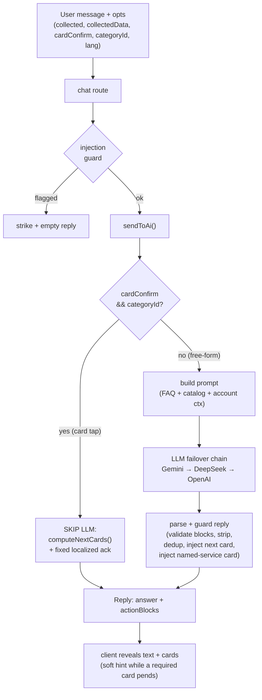
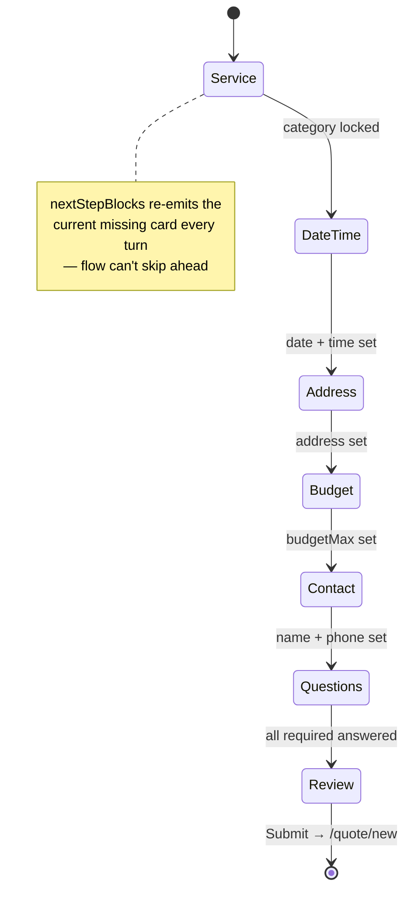

# AI Chat Assistant — Rules, Details & Flows

Single reference for the in-app chat assistant: architecture, the quote flow, every
prompt rule, the deterministic guards, anti-hallucination layers, the QA harness, and the
regression net. Source of truth is the code; this doc explains how the pieces fit.

**Key files**
- Backend logic: [`backend/src/services/chat.service.ts`](../../backend/src/services/chat.service.ts)
- Backend routes: [`backend/src/routes/chat.routes.ts`](../../backend/src/routes/chat.routes.ts)
- Injection guard: [`backend/src/services/chatGuard.ts`](../../backend/src/services/chatGuard.ts)
- Frontend widget: [`frontend/src/app/shared/chat-widget.component.ts`](../../frontend/src/app/shared/chat-widget.component.ts)
- QA harness (pure engine): [`frontend/src/app/shared/chat-qa-harness.ts`](../../frontend/src/app/shared/chat-qa-harness.ts)
- Flow unit tests: [`backend/tests/unit/chat-flow.test.ts`](../../backend/tests/unit/chat-flow.test.ts)

---

## 1. Architecture

```
Frontend (chat-widget.component.ts)
   │  POST /chat/guest            (no auth, stateless — client sends history)
   │  POST /chat/session/:id/message   (auth, server-persisted history)
   ▼
Express route (chat.routes.ts)  →  injection guard  →  sendToAi()
   ▼
sendToAi() (chat.service.ts)
   ├─ CARD-CONFIRM turn?  → deterministic next card, NO LLM   (see §4)
   └─ free-form turn      → build prompt → LLM failover chain → parse/guard reply
   ▼
Reply { answer, actionBlocks } → client renders text bubbles + cards
```



There is **no RAG / vector DB**. Knowledge is assembled deterministically into the prompt
(FAQs by tier, live account data via SQL, the service catalog). This is correct for the
current corpus size — it all fits in the prompt. Revisit only if the knowledge corpus
outgrows the prompt budget.

---

## 2. Request lifecycle

1. **Client** builds the request body: `message`, `history`, `role`, `lang`,
   `categoryLocked`, `collected` (field keys), `collectedData` (exact values),
   `categoryId`, `answeredQuestions`, `cardConfirm`, plus form-assist fields.
2. **Route** validates the body, runs the **injection guard** (`checkInjection`), and on a
   flagged message records a strike and returns an empty reply.
3. **sendToAi** decides: deterministic card-confirm turn (§4) or LLM turn (§5–§8).
4. **Reply** = `{ answer, actionBlocks }`. Auth turns also persist the message.
5. **Client** reveals text bubbles one at a time, then reveals cards one at a time.

---

## 3. Roles & tiers

`TIER_ORDER = [admin, servicer, customer, guest]`. A role sees FAQs for its own tier and
all lower-trust tiers below it. Each role gets a different system prompt persona, platform
facts, and navigation links.

| Role | Sees | Flow |
|------|------|------|
| guest | guest FAQs | can request a service without an account |
| customer | customer + guest | full quote flow + account context (bookings, quotes, credit, points) |
| servicer | servicer + customer + guest | profile/business help, PIN-gated edits |
| admin | all | platform settings, users; gets LLM setup diagnostics on failure |

---

## 4. Deterministic card-confirm turns (LLM skipped)

**The single biggest anti-hallucination mechanism.** When the user **confirms a card**
(taps date/time/budget/address/contact/question, or picks a service) the next card is
fully determined by what's been collected — the LLM would only add prose that can
hallucinate, mistranslate, re-ask, or stall. So those turns skip the LLM entirely.

**Trigger.** The client sets `cardConfirm: true` on the request **only** for card-confirm
sends (via `sendConfirm()` in the widget). Typed messages use `send()`/`sendTyped()` and
stay unflagged. The flag survives the in-flight send queue (`pendingCardConfirm`).

**Backend short-circuit** (`sendToAi`, guarded by `cardConfirm && categoryId`):
```
answer      = localized fixed ack ("Got it." / "Baik." / "好的。" / "சரி." / "Ok, got it.")
actionBlocks = computeNextCards(collected, answeredQuestions, categoryQuestions, lang)
```
No tokens, no latency, no 429, no hallucination. The LLM still handles every **free-form**
turn (questions, service disambiguation, change requests, info chat).

**`computeNextCards`** (pure, unit-tested) reuses `nextStepBlocks` for field order, then:
- a `quote_field` already in `collected` is dropped (a confirmed card is never re-shown);
- when base fields are done, the first **unanswered** `quote_question` is emitted (localized);
- when all questions are answered, the `quote_prefill` review card is emitted.

The ack is a **fixed string**, never LLM-generated, so it cannot hallucinate or
mistranslate. To make the ack-only turn render cleanly the ack is non-empty (an empty
`answer` would hit the client's `|| fallbackReply` and show boilerplate).

---

## 5. The quote flow (field order)

`nextStepBlocks(collected)` is the **single source of truth** for order and never skips
ahead — it re-emits the current missing card every turn until it's filled:

```
1. Service     → quote_options card(s) (user picks; category_lock records the choice)
2. Date + Time → quote_field preferredDate + timeSlot   (both required together)
3. Address     → quote_field address (+ propertyType if missing)
4. Budget      → quote_field budgetMax
5. Contact     → quote_field contactName + contactNumber
6. Questions   → quote_question, one at a time (category's questionSchema)
7. Review      → quote_prefill (full summary; Submit → /quote/new prefilled)
```



Because the order is server-enforced, the user **cannot advance past a missing required
field** — even with the chat input unlocked, the pending card simply reappears until
filled. This is why the input does not need to be locked (see §9).

Required base fields: `preferredDate, timeSlot, address, budgetMax, contactName,
contactNumber`. Optional: `notes`, `budgetMin`, `propertyType` (standalone), and any
`quote_question` with `required: false`.

---

## 6. Action blocks

The LLM embeds machine-readable cards as `[action:TYPE] ...key: value... [/action]` tags.
`parseActionBlocks` extracts them, `stripActionBlocks` removes them from the visible text,
`validateActionBlock` drops invalid ones.

| Type | Purpose | Validation |
|------|---------|-----------|
| `quote_options` | suggest a service | `categoryId` must be a real catalog UUID + non-empty name, else dropped |
| `quote_field` | collect one base field | key must be a known field |
| `quote_question` | record a service-question answer | key must be in the category's real questionSchema, else dropped |
| `quote_prefill` | the review/submit card | renders only as the last message |
| `category_lock` | silently record the confirmed service | UUID must resolve to a category whose name appears in the reply text, else dropped |
| `form_fill` | fill a field on the real /quote/new form | requires a key |
| `profile_field` / `pin_required` | servicer profile edits (PIN-gated) | — |
| `link` / `retry` | navigation / try-again | — |

Unknown types and invented services are dropped by validation.

---

## 7. System prompt rules (free-form LLM turns)

Assembled by `buildSystemPrompt` (FAQ reference + persona) and `buildAssistantPrompt`
(flow rules + catalog + account context). The load-bearing rules:

**Tone & style**
- Warm, concise, plain language; 1–4 sentences; brief greeting on first message only.
- **No em-dashes / dashes** to join clauses or set off asides (sounds templated). Use a
  comma, full stop, or a joining word.
- **No markdown** anywhere (chat renders plain text; markdown shows as raw symbols).
- Never invent policies, prices, or features. If unsure, offer to escalate.

**Language**
- Always reply in the **same language** the user is writing in (en / ms / zh / ta /
  rojak). `opts.lang` pins the language and overrides per-turn detection — templated card
  confirmations ("My budget is RM150") are button clicks, NOT a language switch.
- Service names from the catalog stay in their original form.
- **`convoLang` lifecycle (frontend, `chat-widget`):** the pinned language is sticky
  within a thread (a non-English signal wins; a bare Latin field value won't flip it back).
  It **resets to `en` on `clear()`** (a cleared chat is a new customer) and on a "no, not me"
  identity answer; it is **re-derived from the restored thread** on "yes, it's me" and
  "continue last session" (`deriveConvoLang`). Without the reset, a new customer inherited
  the previous thread's language (e.g. English user answered entirely in Chinese).

**Action-block discipline (guest/customer)**
- Naming a service, asking a date, asking a question, or confirming → MUST emit the
  matching `[action:...]` in the SAME message ("the tag IS the card").
- **Extract first**: pre-fill every detail the user already gave (date, time, budget,
  name, phone, address) with a `value:` line, and never re-ask it.
- Resolve relative dates ("tonight", "next Sunday") to a concrete future `YYYY-MM-DD`.
- One service-question at a time; map free-text answers to the closest option.
- Emit `category_lock` the moment the user confirms a service (by tap OR text).
  - **Client deterministic backstop (`maybeTextConfirmCategory`):** when exactly ONE
    service card is pending and the user types a short affirmation in any supported
    language (en yes/ok/that's it · ms ya/betul/boleh · zh 对/没错/就是这个 · ta ஆம்/சரி),
    the frontend locks that category itself and routes the turn through the card-confirm
    short-circuit — it does NOT wait for the model to emit `category_lock` (which it often
    forgets). Negations and long messages are excluded. This is what stops typing-only
    customers (who never tap) from looping forever on "please tap the card".
- After a rejection, ask ONE clarifying question max, then act (re-offer the best fit).
- Never re-list collected values in prose (the review card is the single source of truth).

**Behavior with messy input**
- Customers ramble, joke, overshare, or say absurd things. Stay unflappable: pull the one
  real serviceable need and pursue it; quietly ignore the rest. A party/event almost
  always maps to Catering.
- Name-mismatch guidance: "wedding planner" → Event Planner, "repaint" → Renovation, etc.
- Budget: never turn a customer away over price; any budget is fine.

**Secret**: "open sesame" reveals the user's role (guest acts confused).

---

## 8. LLM provider chain & resilience

- Keys are admin-managed (`llmApiKey`, encrypted via config vault), cached 60 s, ordered by
  priority. Providers: **Gemini, DeepSeek, OpenAI** (generic = OpenAI-compatible).
- `tryAiChain` streams each provider in priority order with failover.
- **First-token timeout** 15 s (rides out reasoning-model cold starts; reasoning_content
  counts as "alive"); **overall timeout** 60 s.
- **429 cooldown**: a rate-limited/quota'd key is skipped for 60 s instead of re-pinged.
- DeepSeek-v4 are reasoning models: `max_tokens` 4096 so the thinking phase doesn't
  truncate the answer.
- Truncated reply with no usable text → "out of service" + a Request-a-service button.
- Admins get a real setup diagnostic on total failure; customers get a local fallback.
- **One auto-retry on a failed send**: a transient HTTP failure (429 / cold provider /
  dropped connection) retries once after ~3.5 s before showing "Could not send message".
  Distinct from "out of service" (a successful 200 where the LLM chain was exhausted).
- **No `.env` key fallback**: keys come only from the `llmApiKey` DB table — `npm run db:reset`
  leaves it empty (the seed seeds none), so re-add keys in Admin → API Keys after a reset.

---

## 9. Frontend behaviour (chat-widget)

- **Card rendering**: each `actionBlock` renders its own control; cards reveal one at a
  time (300–800 ms apart) for a human feel.
- **Dedup**: a confirmed field renders collapsed (✓ value) via its `*Confirmed` signal +
  `valueCollected`, and drops out of the pending set — never re-editable in-card (edits
  happen later at the quote-review/form stage).
- **Soft input hint (non-blocking)**: while a required card is pending, a hint shows above
  the input (`cardInputHint`, localized, joined when several pend). The input stays fully
  usable — the user can ask anything mid-flow. The flow can't be skipped because the
  server re-shows the pending card (§5), so a UI lock is unnecessary.
- **`sendConfirm()`**: card confirms set `nextSendCardConfirm` so the request carries
  `cardConfirm: true` (§4). The flag is consumed after the body is built and survives the
  in-flight queue via `pendingCardConfirm`.
- **Queue, don't drop**: a confirm fired while a reply is in flight is queued
  (`pendingDraft`) and flushed when idle; `collectedData` carries the full accumulated
  prefill so no field is lost.
- **Stuck watchdog**: if the bot promised a card but emitted none mid-flow, re-fire the
  last message once after 5 s (capped, never loops).
- **Language**: `cardLang` mirrors the last few user messages so a short "yes" doesn't
  flip cards back to English.

---

## 10. Anti-hallucination layers (defence in depth)

| Layer | Catches |
|-------|---------|
| Deterministic card-confirm turns (§4) | most flow hallucination — LLM not even called |
| Server-enforced field order (§5) | skipped steps, jump-to-review |
| `validateActionBlock` | invented services / bad UUIDs |
| `category_lock` text-match check | wrong service locked |
| `quote_question` key whitelist | invented question variants that loop forever |
| Field-context guards | dumping fields before a service is picked |
| Deterministic date/phone/budget extraction | LLM mis-parsing a value the user typed |
| `CONFIRMED DETAILS` prompt block | LLM altering/inventing collected values |
| Banned-words filter (server-side) | configured forbidden words |
| Dash/markdown stripping | template-y prose, raw markdown |
| Named-service card inject (§5) | bot names a service in text but emits no card → inject it (stops the reject/stall loop) |

What is **not** deterministically caught: free-form prose invention (a made-up price/policy
in a normal answer). That is covered only by the QA LLM judge today; a deterministic
grounding check is the recommended next addition.

---

## 11. Security

- **Prompt injection** (`chatGuard.ts`): regex patterns for instruction-override, role
  reassignment, system-prompt extraction, delimiter/format injection. 3 strikes → temporary
  chat ban (admin can unban).
- **Privacy**: never ask for or accept card numbers, CVV, PIN, bank details, passwords,
  OTPs. A fixed safety message is returned if the user shares them.
- **Rate limiting**: guest chat is IP rate-limited (dev raised to 100/min to unblock QA;
  prod stricter). The QA harness paces ≥6 s between sends to stay under the limit.
- **Dev-only routes**: `/chat/qa-log` and `/chat/qa-judge` exist only when
  `NODE_ENV !== 'production'`.

---

## 12. QA harness

Simulates real customers booking end-to-end against the live bot. Persona matrix of
**7 typing × 6 tones × 8 behaviors × 6 sortings × 5 languages = 10,080 combinations**
(× 16 services ≈ 161k scenario shapes), driving the real card handlers — by tap, ~35%
free-text fields, ~40% free-text questions, or fully typed (the `typing_shortcut` /
`typing_adhd` personas never tap a card). Runs until the review card (success) or a stall /
loop / timeout. Per-turn log shows `SENT` (frontend) / `RECV` (backend) / `DATA` (prefill).

**Full rules — axes, possibility calculation, every structural check, the log format, how to
run, known limitations — live in [`chat-qa-harness.md`](chat-qa-harness.md).**

**Fit**: strong for flow/structural correctness; partial for free-form prose hallucination
(only the LLM judge sees it). It's a happy-path booking driver by design (~90% quote-flow).
Requires LLM keys (it drives the real bot).

---

## 13. Regression net (so a refactor / code-simplifier can't silently break the flow)

The chat files are full of guards that look like cruft but are **past bug fixes**. Protect
them before running any sweeping refactor:

1. **Baseline commit** — a known-good revert point.
2. **Unit tests** (`chat-flow.test.ts`) pin `nextStepBlocks` + `computeNextCards` (17
   cases): field order, dedup, question→review handoff, i18n. Run: `npx jest chat-flow`.
3. **QA harness pass-rate gate** — run N scenarios before AND after; the rate must not drop.
4. **`npx tsc --noEmit`** (backend) + **`ng build`** (frontend) — type + template gates.
5. **Diff review** the simplifier's output before merge; never auto-merge over flow code.

Make the tests + harness a gate the simplifier must pass: green → let it work → still green
= safe; red → revert.

---

## 14. Request body reference

Both `/chat/guest` and `/chat/session/:id/message` accept:

| Field | Meaning |
|-------|---------|
| `message` | the user's text (or the templated card-confirm phrase) |
| `history` | prior turns (guest sends them; auth loads from DB) |
| `role`, `lang` | persona + pinned reply language |
| `categoryLocked` | suppress further service suggestions |
| `collected` | confirmed field keys (drives `nextStepBlocks`) |
| `collectedData` | exact confirmed values (so recaps are grounded, never invented) |
| `categoryId` | the locked service |
| `answeredQuestions` | answered question keys |
| `cardConfirm` | **true only on card confirms** → backend skips the LLM (§4) |
| `formAssist` / `formContext` | real /quote/new form-assist mode |
