# MyServicer — Full Function Mapping

> Auto-generated: 2026-06-09  
> Covers every frontend page, shared component, and core service with all method signatures.  
> All flowcharts use **Mermaid** syntax — renders natively on GitHub, VS Code, and most markdown viewers.

---

## Architecture Overview

**Framework:** Angular 18+ standalone components (no NgModules)  
**State:** No global store — state via services + Signals + `@Input()`  
**API Layer:** `ApiService` → HTTP requests to backend routes  
**Routing:** `provideRouter` with `withComponentInputBinding()`, lazy-loaded sub-portal modules

---

## Flowcharts

### 1. Complete Route Map (All 40 Routes + Guards + Loading Strategy)

```mermaid
graph TB
    subgraph "Root - AppComponent"
        ROOT["/"]
    end

    subgraph "Eager / Lazy-Root Routes"
        ROOT -->|eager| HOME["/ → HomeComponent"]
        ROOT -->|lazy| LOGIN["/login → LoginComponent"]
        ROOT -->|lazy| REG["/register → RegisterComponent"]
        ROOT -->|lazy| REGSERV["/register/servicer → MerchantRegisterComponent"]
        ROOT -->|lazy| CALLBACK["/auth/callback → AuthCallbackComponent"]
        ROOT -->|lazy| FORGOT["/auth/forgot → ForgotPasswordComponent"]
        ROOT -->|lazy| RESET["/auth/reset → ResetPasswordComponent"]
        ROOT -->|lazy| GUESTQ["/guest/quote/new → GuestQuoteComponent"]
        ROOT -->|eager| SRV["/services/:parentSlug → ChildrenBrowseComponent"]
        ROOT -->|lazy| TERMS["/terms → TermsComponent"]
        ROOT -->|eager| NOTFOUND["/** → NotFoundComponent"]
    end

    subgraph "customerGuard"
        CUST["/customer/** (lazy)"]
    end

    subgraph "servicerGuard"
        SERV["/servicer/** (lazy)"]
    end

    subgraph "adminGuard"
        ADMIN["/admin/** (lazy)"]
    end

    ROOT --> CUST
    ROOT --> SERV
    ROOT --> ADMIN

    subgraph "Customer Routes (CustomerShellComponent)"
        CUST --> C1["/customer → BrowseComponent"]
        CUST --> C2["/customer/quote/new → QuoteFormComponent"]
        CUST --> C3["/customer/quotes → MyQuotesComponent"]
        CUST --> C4["/customer/quotes/:id/proposals → ProposalsComponent"]
        CUST --> C5["/customer/bookings → MyBookingsComponent"]
        CUST --> C6["/customer/history → OrderHistoryComponent"]
        CUST --> C7["/customer/rewards → RewardsComponent"]
        CUST --> C8["/customer/account → AccountComponent"]
        CUST --> C9["/customer/transactions → TransactionsComponent"]
        CUST --> C10["/customer/notifications → NotificationsComponent"]
        CUST --> C11["/customer/notification-settings → NotificationSettingsComponent"]
    end

    subgraph "Servicer Routes (ServicerShellComponent)"
        SERV --> S1["/servicer → ServicerDashboardComponent"]
        SJOBS["/servicer/jobs"]
        SERV --> SJOBS
        SJOBS --> S2["/pending → ServicerJobsComponent (tab: pending)"]
        SJOBS --> S3["/active → ServicerJobsComponent (tab: active)"]
        SJOBS --> S4["/history → ServicerJobsComponent (tab: history)"]
        SJOBS --> S5["/:id → ServicerJobsComponent (detail overlay)"]
        SERV --> S6["/servicer/services → ServicerServicesComponent"]
        SERV --> S7["/servicer/services/new → ListingWizardComponent"]
        SERV --> S8["/servicer/services/:id/edit → ListingWizardComponent"]
        SERV --> S9["/servicer/promotions → ServicerPromotionsComponent"]
        SERV --> S10["/servicer/invoices → ServicerInvoicesComponent"]
        SERV --> S11["/servicer/deposit → ServicerDepositComponent"]
        SERV --> S12["/servicer/calendar → ServicerCalendarComponent"]
        SERV --> S13["/servicer/account → ServicerAccountComponent"]
        SERV --> S14["/servicer/notifications → NotificationsComponent"]
        SERV --> S15["/servicer/notification-settings → NotificationSettingsComponent"]
    end

    subgraph "Admin Routes (AdminShellComponent)"
        ADMIN --> A1["/admin → AdminDashboardComponent"]
        ADMIN --> A2["/admin/merchants → AdminMerchantsComponent"]
        ADMIN --> A3["/admin/users → AdminUsersComponent"]
        ADMIN --> A4["/admin/queues → AdminQueuesComponent"]
        ADMIN --> A5["/admin/settings → AdminSettingsComponent"]
        ADMIN --> A6["/admin/money-settings → AdminMoneySettingsComponent"]
        ADMIN --> A7["/admin/uiux-settings → AdminUiuxSettingsComponent"]
        ADMIN --> A8["/admin/ai-chat-settings → AdminAiChatSettingsComponent"]
        ADMIN --> A9["/admin/category-settings → AdminCategorySettingsComponent"]
        ADMIN --> A10["/admin/setup → SetupWizardComponent"]
        ADMIN --> A11["/admin/settings/api-keys → ApiKeysComponent (PIN guard)"]
    end

    style CUST fill:#e3f2fd,stroke:#1565c0
    style SERV fill:#e8f5e9,stroke:#2e7d32
    style ADMIN fill:#fff3e0,stroke:#e65100
    style ROOT fill:#f3e5f5,stroke:#6a1b9a
```

### 2. Auth Flow

```mermaid
flowchart TD
    START([User visits site]) --> HOME[HomeComponent]
    HOME -->|"click Login"| LOGIN[LoginComponent]
    HOME -->|"click Register"| REG[RegisterComponent]
    HOME -->|"Register as Servicer"| MERCH[MerchantRegisterComponent]

    %% Login paths
    LOGIN -->|"submit()"| LOGIN_API["POST /auth/login → AuthService.login()"]
    LOGIN -->|"skip()"| DEMO["AuthService.demoLogin(role)"]
    LOGIN -->|"Google OAuth"| GOOGLE["Redirect to Google → AuthCallbackComponent"]
    LOGIN_API --> SESSION["GET /session → AuthService.verifySession()"]
    DEMO --> SESSION
    GOOGLE -->|"completeGoogleAuth()"| SESSION

    %% Register paths
    REG -->|"submit()"| REG_API["POST /auth/register → AuthService.register()"]
    MERCH -->|"step1→step2→submit()"| MERCH_API["AuthService.registerMerchant()"]
    REG_API --> LOGIN_REDIRECT[Redirect to /login]
    MERCH_API --> LOGIN_REDIRECT

    %% Password reset
    FORGOT[ForgotPasswordComponent] -->|"sendResetLink()"| FORGOT_API["POST /auth/forgot"]
    RESET[ResetPasswordComponent] -->|"resetPassword()"| RESET_API["POST /auth/reset"]

    %% Session outcomes
    SESSION -->|"isLoggedIn"| GUARD_CHECK{Route Guard}
    GUARD_CHECK -->|"customer"| CUST_PORTAL[Customer Portal]
    GUARD_CHECK -->|"servicer"| SERV_PORTAL[Servicer Portal]
    GUARD_CHECK -->|"admin"| ADMIN_PORTAL[Admin Portal]
    GUARD_CHECK -->|"guest"| GUEST[GuestQuoteComponent]

    %% Demo gate
    SESSION -->|"requiresDemoGate()"| PIN[PinService.requireGatePin()]
    PIN -->|"correct PIN"| GUARD_CHECK

    %% PIN auth for admin actions
    A3_PIN["/admin/users (pin guard)"] -.->|"requirePin()"| PIN2[PinService.requirePin()]
    A4_PIN["/admin/queues (pin guard)"] -.-> PIN2
    A11_PIN["/admin/settings/api-keys (pin guard)"] -.-> PIN2

    style START fill:#c8e6c9
    style SESSION fill:#fff9c4
    style GUARD_CHECK fill:#ffccbc

    %% Login + Register flow through both paths
    style LOGIN_API fill:#e3f2fd
    style REG_API fill:#e3f2fd
    style GOOGLE fill:#bbdefb
    style DEMO fill:#fff3e0

    %% Auth result flow
    style CUST_PORTAL fill:#e3f2fd
    style SERV_PORTAL fill:#e8f5e9
    style ADMIN_PORTAL fill:#fff3e0
    style GUEST fill:#f3e5f5
```

### 3. Quote Flow (Customer + Guest)

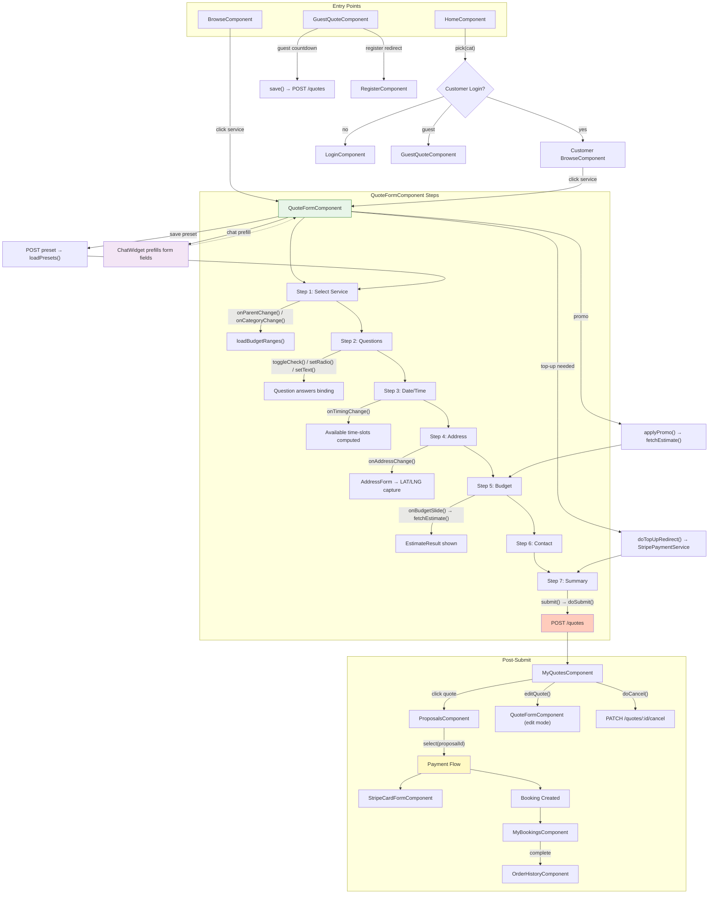

#### 3a. Chat address card — HARD-LOCKED until confirmed

The address is the one chat field that locks the composer: while an unconfirmed
`quote_field:address` card is on screen the input + send are disabled, because the
structured fields (No./Street/Postcode/Type + geocode) cannot be captured from free text
and an unstructured address blocks the quote form at page 2. See the address-lock rule in
`ai-chat.md`.

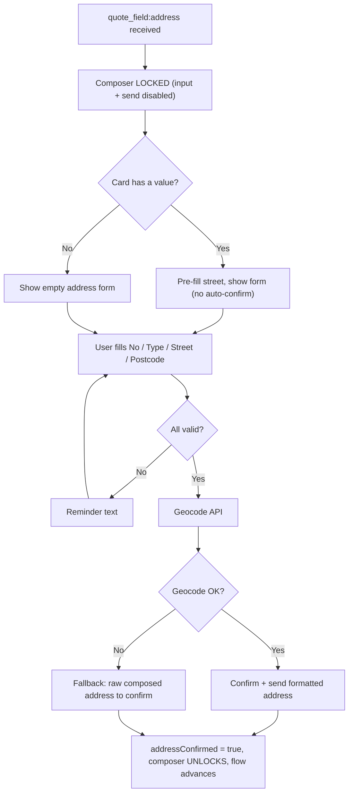

### 4. Servicer Job Lifecycle

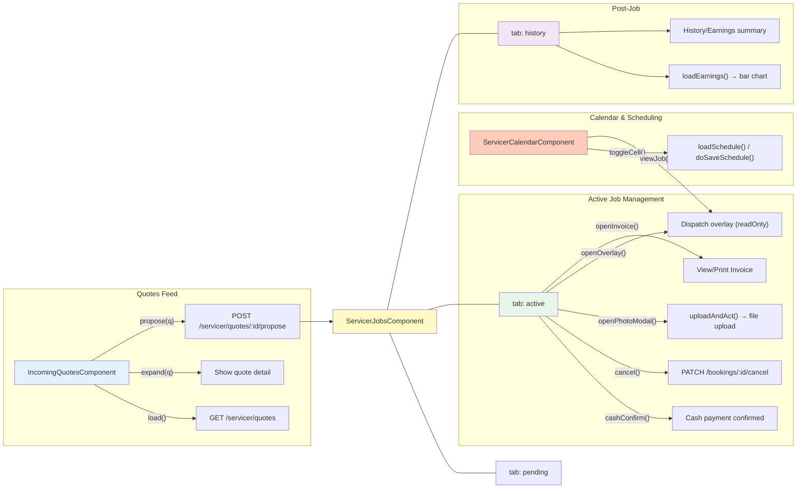

### 5. Admin Portal Flow

```mermaid
flowchart TD
    DASH[AdminDashboardComponent]
    DASH -->|"setRevenueRange()"| REV["Revenue chart ± buildChart()"]

    DASH --> MERCH[AdminMerchantsComponent]
    MERCH -->|"load()"| MERCH_LIST["GET /admin/merchants"]
    MERCH -->|"ban() / unban()"| MERCH_ACT["POST /admin/merchants/:id/ban"]

    DASH --> USERS[AdminUsersComponent]
    USERS -->|"loadUsers() / loadMerchants()"| USERS_LIST["Tab: All Users / Servicers"]
    USERS -->|"openEdit() / saveEdit()"| USERS_EDIT["Edit user profile"]
    USERS -->|"openActivity()"| USERS_ACT["View user activity log"]

    DASH --> QUEUES[AdminQueuesComponent]
    QUEUES -->|"reviewWithdrawal()"| QUEUE_1["Approve/Reject Withdrawals"]
    QUEUES -->|"reviewAppeal()"| QUEUE_2["Approve/Reject Appeals"]
    QUEUES -->|"reviewCategory()"| QUEUE_3["Approve/Reject Category Requests"]
    QUEUES -->|"reviewIdentity()"| QUEUE_4["Approve/Reject Identity Changes"]

    DASH --> SETTINGS[AdminSettingsComponent]
    SETTINGS -->|"multiple tabs"| SETT_TABS["Categories | Budgets | Time Slots | Postcodes | Bans | Promos"]
    SETTINGS -->|"saveNum() / save()"| SETT_SAVE["Persist settings to backend"]

    DASH --> MONEY[AdminMoneySettingsComponent]
    MONEY -->|"saveFeeRate()"| MONEY_1["Platform fee rate"]
    MONEY -->|"saveFeeBreakdown()"| MONEY_2["Fee structure per segment"]
    MONEY -->|"saveTier() / saveReward()"| MONEY_3["Loyalty tiers & rewards"]

    DASH --> UIUX[AdminUiuxSettingsComponent]
    UIUX -->|"saveLandingText()"| UIUX_1["Landing page copy"]
    UIUX -->|"uploadCatBanner()"| UIUX_2["Category banners/images"]
    UIUX -->|"saveHeroBanner()"| UIUX_3["Hero banner config"]
    UIUX -->|"uploadSound()"| UIUX_4["Notification/chat sounds"]

    DASH --> AICHAT[AdminAiChatSettingsComponent]
    AICHAT -->|"saveGeneral()"| CHAT_1["AI enable/disable toggles"]
    AICHAT -->|"savePrompt() / saveTone()"| CHAT_2["Custom prompt & tone"]
    AICHAT -->|"saveGreetings()"| CHAT_3["Tiered greeting pools"]
    AICHAT -->|"saveBannedWords()"| CHAT_4["Banned word filter"]
    AICHAT -->|"save() / togglePublish()"| CHAT_5["FAQ entries CRUD"]

    DASH --> CAT[AdminCategorySettingsComponent]
    CAT -->|"openNew() / openEdit()"| CAT_1["Category CRUD"]
    CAT -->|"saveBasics()"| CAT_2["Name, slug, parent, icon"]
    CAT -->|"saveSchema()"| CAT_3["Question schema + pricing"]
    CAT -->|"saveBudgetRanges()"| CAT_4["Budget ranges"]
    CAT -->|"saveSlots()"| CAT_5["Time slot configuration"]
    CAT -->|"bulkPublish()"| CAT_6["Bulk toggle publish"]

    DASH --> APIKEY[ApiKeysComponent]
    APIKEY -->|"addNew() / saveKey()"| KEY_1["LLM API key CRUD"]
    APIKEY -->|"saveFallback()"| KEY_2["Fallback key config"]
    APIKEY -->|"seedDemoKeys()"| KEY_3["Demo key seeding"]

    style DASH fill:#fff3e0,stroke:#e65100
```

### 6. Chat Widget Flow (AI Assistant)

```mermaid
flowchart TD
    subgraph "Entry"
        OPEN[ChatWidgetService.open() / toggle()]
        OPEN --> GREETING["getGreeting() → injectAssistantMessage()"]
        OPEN --> GUEST_AUTO{"guestAutoOpen?"}
        GUEST_AUTO -->|"yes"| G_LOAD["loadGuest()"]
        GUEST_AUTO -->|"no"| WAIT["Idle: wait for user message"]
    end

    subgraph "Guest Mode"
        G_LOAD --> G_SESSION["ensureSession() → createSession()"]
        G_SESSION --> G_LOAD_MSGS["loadMessages() from localStorage"]
        G_LOAD_MSGS --> G_PREFILL["readGuestPrefill() → show prefill summary"]
        G_PREFILL --> G_CARDS["Show card chain: identity → address → contact → service"]
        G_CARDS --> G_Q_A["Category selection card"]
        G_Q_A -->|"continueQuoteInChat()"| G_QA["Question cards flow"]
        G_QA -->|"submitPrefill()"| G_SUBMIT["persistGuestPrefill() → redirect"]
    end

    subgraph "Authenticated Mode"
        WAIT --> AUTH_MSG["User types → send()"]
        AUTH_MSG --> SEND_AUTH["sendAuthenticated() → POST /chat/messages"]
        SEND_AUTH --> WS_REPLY["SocketService.on('chat_reply') → delayedReply()"]
        WS_REPLY --> PARSE["splitReply() → revealParts() / revealCards()"]
        PARSE --> CARD_LOOP{"Action card type?"}
        CARD_LOOP -->|"text_input"| TEXT_C["confirmText()"]
        CARD_LOOP -->|"date"| DATE_C["onDateSelected() → confirmDate()"]
        CARD_LOOP -->|"time_slot"| TIME_C["onTimeSlotSelected() → confirmTime()"]
        CARD_LOOP -->|"address"| ADDR_C["onChatPlaceSelect() → confirmAddress()"]
        CARD_LOOP -->|"radio / checkbox"| Q_C["answerRadio() / toggleQCheckbox()"]
        CARD_LOOP -->|"budget_slider"| BUDGET_C["onBudgetSlide() → confirmBudget()"]
        CARD_LOOP -->|"profile"| PROF_C["editProfileField()"]
        CARD_LOOP -->|"navigation"| NAV_C["navigateAction()"]
    end

    subgraph "Quote Prefill Bridge"
        PARSE --> PREFILL{"formAssistBody()"}
        PREFILL -->|"applyFormFills()"| BRIDGE["QuoteAssistBridge.setField()"]
        BRIDGE --> QF_FORM["QuoteFormComponent.applyChatPrefill()"]
    end

    subgraph "Helper Systems"
        PARSE --> SOUND["checkChatSoundSetting() → playChatSound()"]
        PARSE --> STUCK["armStuckWatchdog() → retryLastMessage()"]
        PARSE --> CLEAR_QUOTE["maybeClearQuote() → resetQuoteFlowState()"]
    end

    style OPEN fill:#f3e5f5
    style CARD_LOOP fill:#ffccbc
    style BRIDGE fill:#fff9c4
```

### 7. Component → Service Dependency Graph

```mermaid
graph LR
    subgraph "Core Services"
        API[ApiService]
        AUTH[AuthService]
        CFG[ConfigService]
        WIDGET[ChatWidgetService]
        DIALOG[DialogService]
        NOTIF_PANEL[NotificationPanelService]
        NOTIF[NotificationService]
        PIN[PinService]
        SOCKET[SocketService]
        STRIPE[StripePaymentService]
        THEME[ThemeService]
        TOAST[ToastService]
        ASSIST[QuoteAssistBridge]
        QA[ChatQaService]
        BRIDGE[QaFormBridge]
    end

    subgraph "Shared Components"
        CHAT_W[ChatWidgetComponent]
        SHELL[ShellComponent]
        SNACK[SnackbarComponent]
        PIN_PROMPT[PinPromptComponent]
        DIALOG_OUT[DialogOutletComponent]
        NOTIF_PAN[NotificationPanelComponent]
        MAP[MapViewComponent]
        STRIPE_FORM[StripeCardFormComponent]
        PLACES[PlacesAutocompleteComponent]
    end

    subgraph "Auth Pages"
        LOGIN_P[LoginComponent]
        REG_P[RegisterComponent]
        MERCH_P[MerchantRegisterComponent]
    end

    subgraph "Customer Pages"
        QF[QuoteFormComponent]
        PROP[ProposalsComponent]
        BOOK[MyBookingsComponent]
        ACCT[AccountComponent]
        REW[RewardsComponent]
    end

    subgraph "Servicer Pages"
        JOBS[ServicerJobsComponent]
        DEP[ServicerDepositComponent]
        SACC[ServicerAccountComponent]
    end

    subgraph "Admin Pages"
        AMERCH[AdminMerchantsComponent]
        AUSERS[AdminUsersComponent]
        ASET[AdminSettingsComponent]
        AKEY[ApiKeysComponent]
    end

    %% Everyone uses ApiService
    LOGIN_P --> API
    REG_P --> API
    MERCH_P --> API
    QF --> API
    PROP --> API
    BOOK --> API
    ACCT --> API
    REW --> API
    JOBS --> API
    DEP --> API
    SACC --> API
    AMERCH --> API
    AUSERS --> API
    ASET --> API
    AKEY --> API
    CHAT_W --> API
    SHELL --> API

    %% Auth pages
    LOGIN_P --> AUTH
    LOGIN_P --> CFG
    REG_P --> AUTH
    REG_P --> CFG
    MERCH_P --> AUTH

    %% Customer pages
    QF --> AUTH
    QF --> STRIPE
    QF --> ASSIST
    QF --> CFG
    PROP --> SOCKET
    BOOK --> SOCKET
    BOOK --> DIALOG
    BOOK --> TOAST
    BOOK --> WIDGET
    BOOK --> STRIPE
    ACCT --> AUTH
    ACCT --> DIALOG
    ACCT --> TOAST
    REW --> AUTH

    %% Servicer pages
    JOBS --> SOCKET
    JOBS --> DIALOG
    JOBS --> TOAST
    DEP --> STRIPE
    DEP --> TOAST
    SACC --> AUTH
    SACC --> DIALOG
    SACC --> TOAST

    %% Admin pages
    AMERCH --> PIN
    AMERCH --> DIALOG
    AMERCH --> TOAST
    AUSERS --> PIN
    AUSERS --> DIALOG
    AUSERS --> TOAST
    ASET --> PIN
    AKEY --> PIN
    AKEY --> DIALOG

    %% Chat widget
    CHAT_W --> WIDGET
    CHAT_W --> AUTH
    CHAT_W --> SOCKET
    CHAT_W --> PIN
    CHAT_W --> ASSIST
    CHAT_W --> BRIDGE
    CHAT_W --> QA

    %% Shell
    SHELL --> CFG
    SHELL --> WIDGET
    SHELL --> AUTH
    SHELL --> NOTIF
    SHELL --> NOTIF_PANEL
    SHELL --> THEME
    SHELL --> SOCKET
    SHELL --> TOAST
    SHELL --> DIALOG
    SHELL --> STRIPE

    %% Overlays
    SNACK --> NOTIF
    SNACK --> TOAST
    PIN_PROMPT --> PIN
    DIALOG_OUT --> DIALOG
    NOTIF_PAN --> NOTIF
    NOTIF_PAN --> NOTIF_PANEL
    NOTIF_PAN --> AUTH
    MAP --> CFG
    PLACES --> CFG

    style API fill:#ffccbc
    style AUTH fill:#e3f2fd
    style CFG fill:#e8f5e9
```

### 8. Backend API Route → Service → Middleware Pipeline

```mermaid
flowchart TD
    REQ([HTTP Request]) --> GLOBAL[Express App]
    GLOBAL --> RATE[rate-limit middleware]
    RATE --> IDEM[idempotency middleware]
    IDEM --> ROUTER{apiRouter}

    subgraph "Router Mounts"
        ROUTER --> AUTH_R["/auth/* → auth.routes.ts"]
        ROUTER --> CAT_R["/categories/*"]
        ROUTER --> QUOTE_R["/quotes/*"]
        ROUTER --> USER_R["/user/*"]
        ROUTER --> SERVICER_R["/servicer/*"]
        ROUTER --> SERVICERS_R["/servicers/* → servicers.routes.ts"]
        ROUTER --> BOOK_R["/bookings/*"]
        ROUTER --> FILE_R["/files/*"]
        ROUTER --> ADMIN_R["/admin/*"]
        ROUTER --> CHAT_R["/chat/*"]
        ROUTER --> NOTIF_R["/notifications/*"]
        ROUTER --> STRIPE_R["/stripe/*"]
        ROUTER --> REWARD_R["/rewards/*"]
        ROUTER --> PRICE_R["/servicer/pricing-modules/*"]
        ROUTER --> LLM_R["/admin/llm-keys/*"]
    end

    subgraph "Auth Middleware (per-route)"
        AUTH_R --> AUTH_MW["requireAuth (JWT)"]
        USER_R --> AUTH_MW
        QUOTE_R --> AUTH_MW
        SERVICER_R --> AUTH_MW
        BOOK_R --> AUTH_MW
        FILE_R --> AUTH_MW
        ADMIN_R --> AUTH_MW
        CHAT_R --> AUTH_MW
        NOTIF_R --> AUTH_MW
        STRIPE_R --> AUTH_MW
        REWARD_R --> AUTH_MW
        PRICE_R --> AUTH_MW
        LLM_R --> AUTH_MW
    end

    subgraph "PIN Middleware (admin actions)"
        ADMIN_R --> PIN_MW["pin middleware (verify PIN)"]
    end

    subgraph "Zod Validation (select routes)"
        QUOTE_R --> VALIDATE_MW["validate middleware (Zod schemas)"]
        BOOK_R --> VALIDATE_MW
        ADMIN_R --> VALIDATE_MW
    end

    subgraph "Service Layer"
        AUTH_R --> AUTH_SVC["auth.service.ts + google-auth.service.ts"]
        SERVICER_R --> SVC_GROUP_1["deposit.service | invoice.service | promotion.service | servicer-account.service | servicer-service.service | identity-change.service | credit.service"]
        QUOTE_R --> QUOTE_SVC["quote.service + servicer-quote.service + auto-accept.service + dispatch.service"]
        BOOK_R --> BOOK_SVC["booking.service + invoice.service"]
        CHAT_R --> CHAT_SVC["chat.service + chatGuard.ts"]
        FILE_R --> FILE_SVC["file.service"]
        NOTIF_R --> NOTIF_SVC["notification.service"]
        STRIPE_R --> LEDGER_SVC["ledger.service"]
        REWARD_R --> POINTS_SVC["points.service"]
        ADMIN_R --> ADMIN_SVC["admin.service + settings.service"]
        PRICE_R --> PRICE_SVC["pricing-module.service"]
        USER_R --> DEACTIVATE_SVC["deactivate.service"]
    end

    subgraph "Error Handling"
        SVC_GROUP_1 --> ERROR_MW[error middleware (global catch)]
        QUOTE_SVC --> ERROR_MW
        BOOK_SVC --> ERROR_MW
        CHAT_SVC --> ERROR_MW
        ADMIN_SVC --> ERROR_MW
        ERROR_MW --> RESP([JSON Error Response])
    end

    style AUTH_MW fill:#ffcdd2
    style PIN_MW fill:#fff3e0
    style VALIDATE_MW fill:#e3f2fd
    style ERROR_MW fill:#ffccbc
```

### 9. App Initialization Sequence

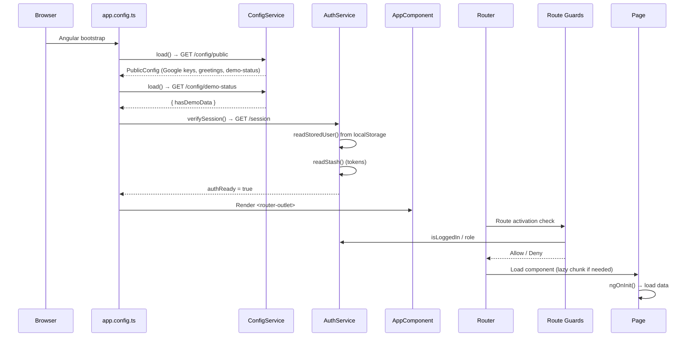

### 10. Real-time Notification Pipeline

```mermaid
flowchart LR
    subgraph "Backend"
        EVENT[Business Event] --> NOTIF_SVC_BE[notification.service.ts]
        NOTIF_SVC_BE --> WS_EMIT["Socket.IO emit(event, data)"]
    end

    subgraph "Frontend"
        WS_ON["SocketService.on<T>(event)"] -->|"chat_reply"| CHAT_WID[ChatWidgetComponent]
        WS_ON -->|"notification"| NOTIF_SVC_FE[NotificationService]
        WS_ON -->|"booking_update"| BOOK_PAGE[MyBookingsComponent]
        WS_ON -->|"proposal_new"| PROP_PAGE[ProposalsComponent]
        WS_ON -->|"job_update"| JOBS_PAGE[ServicerJobsComponent]
        WS_ON -->|"quote_update"| QUOTE_PAGE[IncomingQuotesComponent]
        WS_ON -->|"credit_update"| SHELL_COMP[ShellComponent → updateCredit()]
        WS_ON -->|"mode_switch"| SHELL_COMP_MODE[ShellComponent → mode sync]
    end

    subgraph "UI Layer"
        NOTIF_SVC_FE --> SNACKBAR[SnackbarComponent]
        NOTIF_SVC_FE --> NOTIF_PAN[NotificationPanelComponent]
        NOTIF_SVC_FE -->|"playNotificationSound()"| SOUND[Sound Effect]
        CHAT_WID -->|"delayedReply()"| CHAT_UI[Chat message bubbles + cards]
    end

    style WS_EMIT fill:#e8f5e9
    style WS_ON fill:#e3f2fd
    style SNACKBAR fill:#ffccbc
```

### 11. Global Overlays (AppComponent template)

- `SnackbarComponent` — toast notifications
- `PinPromptComponent` — admin/demo PIN entry
- `DialogOutletComponent` — confirm/prompt dialogs
- `ChatWidgetComponent` — AI chat assistant
- `NotificationPanelComponent` — notification inbox
- `SiteFooterComponent` — site footer

---

## User Journey / Logical Flow Diagrams

### 12. Customer Full Journey (Browse → Quote → Book → Complete → Repeat)

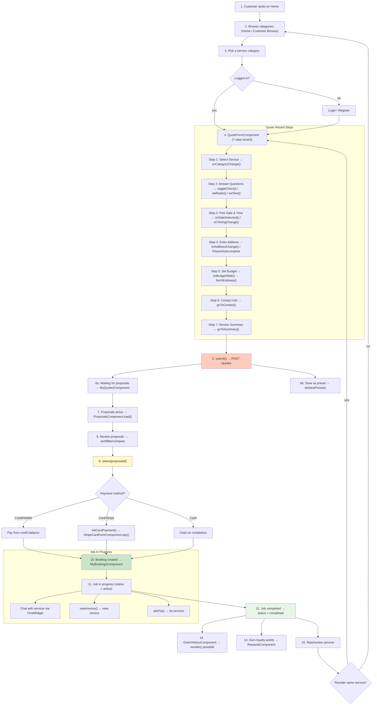

### 13. Guest Quote Flow (Unregistered User)

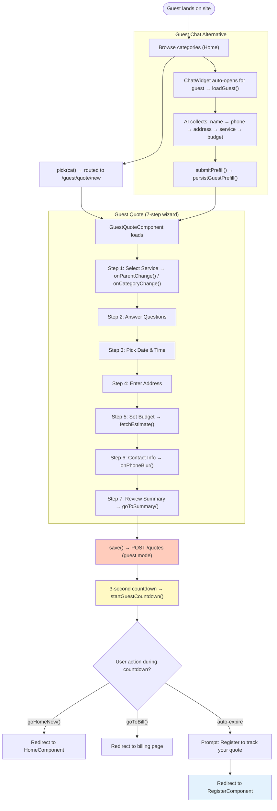

### 14. Servicer Onboarding Flow (Register → Profile → Go Online)

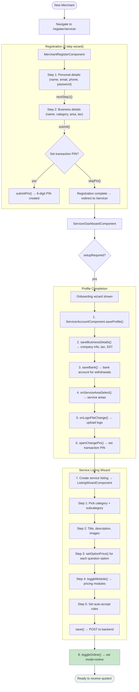

### 15. Servicer Daily Operations (Quote → Propose → Job → Pay)

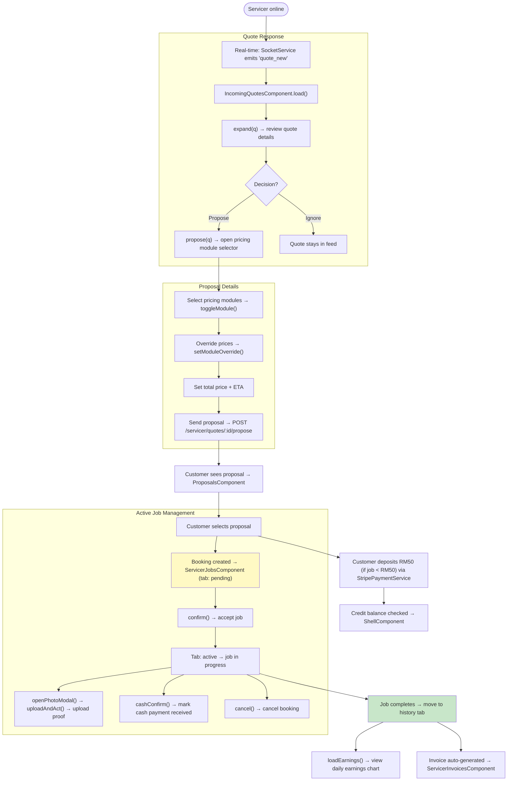

### 16. Payment & Credit Flow

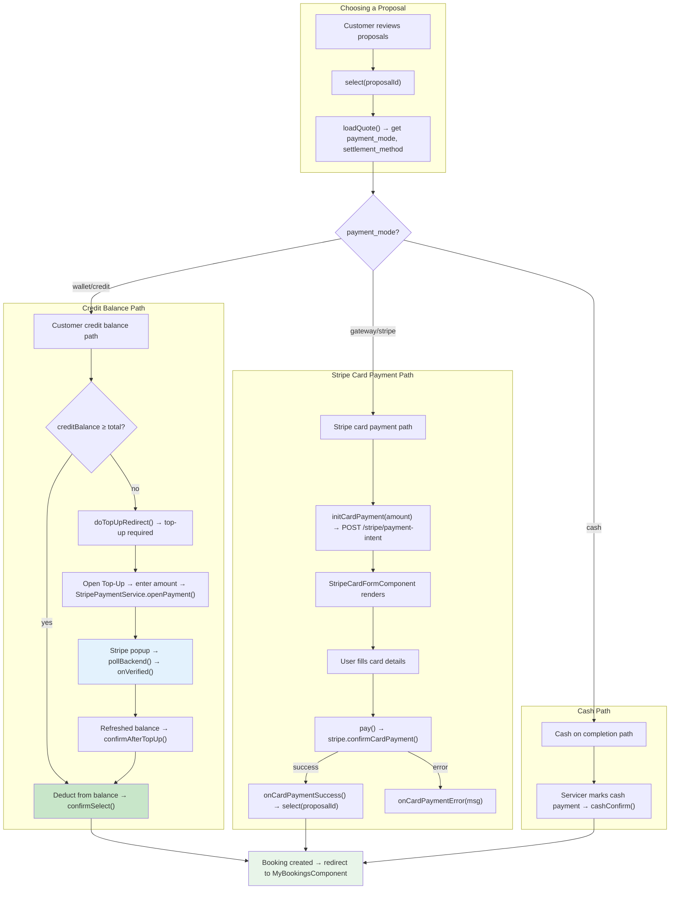

### 17. Top-Up / Deposit / Withdraw Flow

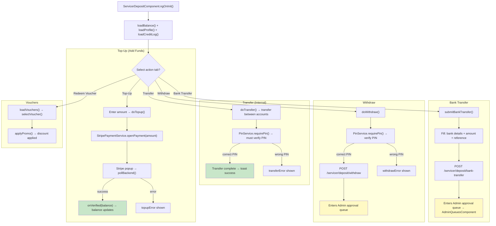

### 18. Rewards & Loyalty Flow

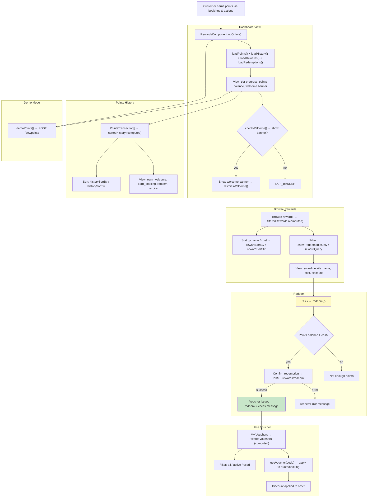

### 19. Chat AI → Quote Form Bridge Flow

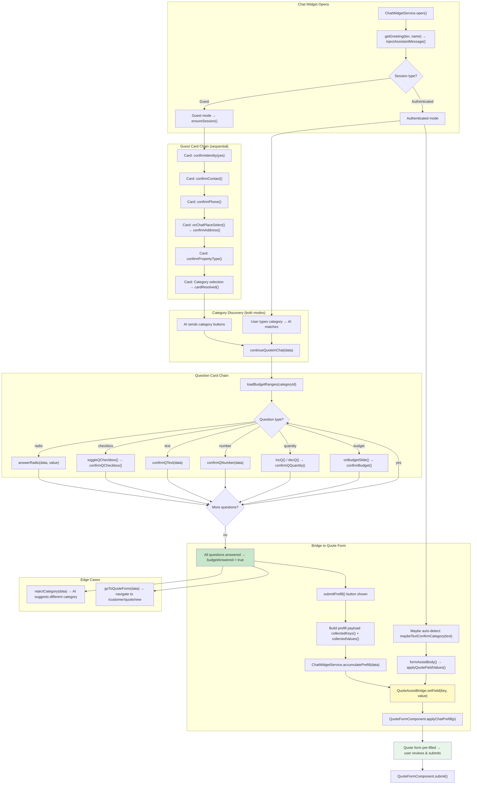

### 20. Admin Approval Queues Flow

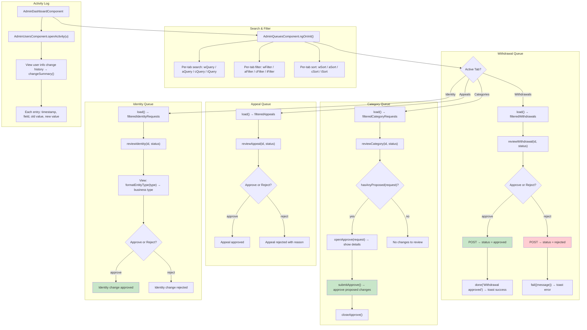

### 21. Category Lifecycle Flow (Admin → Servicer → Customer)

```mermaid
flowchart LR
    subgraph "1. Admin Creates Category"
        A_START["AdminCategorySettingsComponent"]
        A_START --> A_NEW["openNew() → category editor opens"]
        A_NEW --> A_BASICS["saveBasics(): name, slug, parent ID, icon"]
        A_BASICS --> A_SCHEMA["saveSchema(): question schema + option prices"]
        A_SCHEMA --> A_BUDGET["saveBudgetRanges(): min/max budget tiers"]
        A_BUDGET --> A_SLOTS["saveSlots(): available time slots"]
        A_SLOTS --> A_IMAGERY["saveImagery(): thumbnail/banner"]
        A_IMAGERY --> A_PUBLISH["bulkPublish(true) → category is live"]
    end

    subgraph "2. Admin Configures Platform"
        SETTINGS["AdminSettingsComponent"]
        SETTINGS --> SET_CAT["selectCategory(id) → edit budget ranges"]
        SET_CAT --> SET_SLOTS["toggleTimeSlot() + saveTimeSlots()"]
        SET_SLOTS --> SET_POSTCODES["Postcodes management"]
        SET_POSTCODES --> SET_DISPATCH["Dispatch settings per category"]
    end

    A_PUBLISH --> HOME_VIS["3. Category appears on HomeComponent"]
    SET_DISPATCH --> HOME_VIS

    subgraph "3. Customer Browsing"
        HOME_VIS --> CUST_VIEW["Customer sees category card (name, icon, image)"]
        CUST_VIEW --> CUST_CLICK["pick(cat) → navigate based on login state"]
        CUST_CLICK -->|"Logged in"| CUST_QUOTE["QuoteFormComponent → select category"]
        CUST_CLICK -->|"Guest"| GUEST_QUOTE["GuestQuoteComponent → select category"]
    end

    subgraph "4. Servicer Creates Listing"
        CUST_QUOTE --> SERV_CREATE{"Servicer has listing in this category?"}
        SERV_CREATE -->|"no"| SERV_WIZARD["ListingWizardComponent"]
        SERV_WIZARD --> SERV_PICK["Pick same parent + subcategory"]
        SERV_PICK --> SERV_PRICE["setOptionPrice() → price each question option"]
        SERV_PRICE --> SERV_MODULES["toggleModule() → pricing modules"]
        SERV_MODULES --> SERV_SAVE["save() → service listing published"]
    end

    subgraph "5. Quote → Booking Loop"
        SERV_SAVE --> QUOTE_SENT["Customer quote matched to servicer"]
        QUOTE_SENT --> PROPOSAL["Servicer sends proposal → pricing modules applied"]
        PROPOSAL --> BOOKING["Customer accepts → booking created"]
    end

    subgraph "6. Admin Maintenance"
        BOOKING --> ADMIN_REVIEW["Admin reviews: dispatch config, time slots, budgets"]
        ADMIN_REVIEW -->|"edit"| CAT_EDIT["openEdit(cat) → adjust any field"]
        ADMIN_REVIEW -->|"delete"| CAT_DEL["confirmDelete(cat) → cascade to subcats/services"]
    end

    style A_PUBLISH fill:#c8e6c9
    style BOOKING fill:#e8f5e9
```

### 22. Real-Time Notification & Event Flow

```mermaid
flowchart TD
    subgraph "Backend Events"
        EVENT1["Quote submitted → 'quote_new'"]
        EVENT2["Proposal sent → 'proposal_new'"]
        EVENT3["Booking updated → 'booking_update'"]
        EVENT4["Job completed → 'job_complete'"]
        EVENT5["Credit changed → 'credit_update'"]
        EVENT6["Invoice generated → 'invoice_new'"]
        EVENT7["Points earned → 'points_earn'"]
        EVENT8["Admin approved → 'queue_update'"]
        EVENT9["Chat message → 'chat_reply'"]
    end

    subgraph "Socket Emit (Backend)"
        EVENT1 --> SOCKET_EMIT["Socket.IO emit to room(s)"]
        EVENT2 --> SOCKET_EMIT
        EVENT3 --> SOCKET_EMIT
        EVENT4 --> SOCKET_EMIT
        EVENT5 --> SOCKET_EMIT
        EVENT6 --> SOCKET_EMIT
        EVENT7 --> SOCKET_EMIT
        EVENT8 --> SOCKET_EMIT
        EVENT9 --> SOCKET_EMIT
    end

    subgraph "Socket On (Frontend)"
        SOCKET_EMIT --> SOCKET_ON["SocketService.on<T>(event)"]
        SOCKET_ON --> DISPATCH{Event type?}

        DISPATCH -->|"chat_reply"| CHAT["ChatWidgetComponent → delayedReply()"]
        DISPATCH -->|"notification"| NOTIF["NotificationService → items signal updated"]
        DISPATCH -->|"booking_update"| BOOKINGS["MyBookingsComponent → live refresh"]
        DISPATCH -->|"proposal_new"| PROPOSALS["ProposalsComponent → live refresh"]
        DISPATCH -->|"job_update"| JOBS["ServicerJobsComponent → live refresh"]
        DISPATCH -->|"quote_update"| QUOTES["MyQuotesComponent / IncomingQuotes → live refresh"]
        DISPATCH -->|"credit_update"| CREDIT["ShellComponent → updateCredit(balance)"]
        DISPATCH -->|"mode_switch"| MODE["ShellComponent → mode sync"]
    end

    subgraph "UI Layer Updates"
        NOTIF --> TOAST["ToastService.show() → SnackbarComponent"]
        NOTIF --> PANEL["NotificationPanelComponent.items updated"]
        NOTIF --> SOUND["playNotificationSound() (if enabled)"]
        NOTIF --> UNREAD["unread count badge updated"]

        CHAT --> TYPING["playTypingSound() → revealParts()"]
        CHAT --> BUBBLES["New message bubbles render"]
        CHAT --> STUCK_RESET["clearStuckTimer()"]

        BOOKINGS --> BOOKING_LIST["Booking list filtered/sorted"]
        PROPOSALS --> PROP_LIST["Proposal list updates"]
        JOBS --> JOB_TABS["Pending/Active/History tabs update"]
        CREDIT --> BALANCE_CHIP["Credit balance chip in navbar"]
    end

    subgraph "Notification Actions"
        TOAST --> CLICK_TOAST["User clicks toast → navigate to target"]
        PANEL --> OPEN_PANEL["User opens notification panel → markRead(id)"]
        PANEL --> ITEM_CLICK["User clicks notification → routeFor(n) → navigate"]
        PANEL --> MARK_ALL["User clicks Mark All Read → markAllRead()"]
        PANEL --> DISMISS["dismissItem() → remove from list"]
    end

    style SOCKET_EMIT fill:#e8f5e9
    style SOCKET_ON fill:#e3f2fd
    style TOAST fill:#ffccbc
    style PANEL fill:#f3e5f5
```

### 23. Account & Security Management Flow

```mermaid
flowchart TD
    ACCOUNT_PAGE["Account page loads (Customer or Servicer)"]

    subgraph "Customer Account"
        ACCOUNT_PAGE --> C_PROFILE["AccountComponent.ngOnInit()"]
        C_PROFILE --> C_AVATAR["Avatar: onAvatarFileChange() / removeAvatar()"]
        C_PROFILE --> C_SAVE["saveProfile() → PATCH /user/profile"]

        C_PROFILE --> C_ADDR["Address Management"]
        C_ADDR --> C_ADDR_OPEN["openAddress() → edit/create"]
        C_ADDR_OPEN --> C_ADDR_PLACE["onPlaceSelect(place) → Google Places"]
        C_ADDR_PLACE --> C_ADDR_SAVE["saveAddress()"]
        C_ADDR_SAVE --> C_ADDR_REMOVE["removeAddress() if needed"]

        C_PROFILE --> C_CONTACTS["Contact Presets"]
        C_CONTACTS --> C_CONT_OPEN["openContact() → edit/create"]
        C_CONT_OPEN --> C_CONT_SAVE["saveContact()"]
        C_CONT_SAVE --> C_SET_DEF["setDefaultPreset(preset)"]

        C_PROFILE --> C_NOTIF["Notification Preferences"]
        C_NOTIF --> C_NOTIF_TOGGLE["updateNotifPref(group, field, value)"]
        C_NOTIF_TOGGLE --> C_NOTIF_SAVE["saveNotifPrefs()"]

        C_PROFILE --> C_DEACTIVATE["Account Deactivation"]
        C_DEACTIVATE --> C_DEAC_STEPS["3-step confirmation"]
        C_DEAC_STEPS --> C_DEAC_EXEC["doDeactivate() → POST /user/deactivate"]
    end

    subgraph "Servicer Account"
        ACCOUNT_PAGE --> S_PROFILE["ServicerAccountComponent.ngOnInit()"]
        S_PROFILE --> S_AVATAR["Logo: onLogoFileChange() / Personal avatar"]
        S_PROFILE --> S_SAVE["saveProfile() / savePersonalProfile()"]

        S_PROFILE --> S_BUSINESS["Business Details"]
        S_BUSINESS --> S_BIZ_SAVE["saveBusinessDetails() + saveTaxConfig()"]
        S_BIZ_SAVE --> S_SST["onSstToggled() → toggle SST"]

        S_PROFILE --> S_BANK["Bank Details"]
        S_BANK --> S_BANK_SAVE["saveBank() → account number, bank name"]

        S_PROFILE --> S_AREAS["Service Areas"]
        S_AREAS --> S_AREA_ADD["onServiceAreaSelect(place)"]
        S_AREA_ADD --> S_AREA_DEL["removeServiceArea(index)"]

        S_PROFILE --> S_PENALTY["Penalties"]
        S_PENALTY --> S_PEN_LOAD["load data → filter/sort"]
        S_PENALTY --> S_APPEAL["fileAppeal(pen) → submits to admin queue"]

        S_PROFILE --> S_PIN["PIN Management"]
        S_PIN --> S_PIN_LOAD["loadPinStatus() → hasPin"]
        S_PIN --> S_PIN_CHANGE["openChangePin() → doChangePin()"]
        S_PIN --> S_PIN_VERIFY["openVerifyPin() → doVerifyPin()"]

        S_PROFILE --> S_DEACTIVATE["Account Deactivation"]
        S_DEACTIVATE --> S_DEAC_STEPS["3-step confirmation"]
        S_DEAC_STEPS --> S_DEAC_EXEC["doDeactivate() → POST /user/deactivate"]
    end

    style C_DEACTIVATE fill:#ffcdd2
    style S_DEACTIVATE fill:#ffcdd2
```

### 24. Calendar & Schedule Management Flow

```mermaid
flowchart TD
    CAL_PAGE["ServicerCalendarComponent.ngOnInit()"]

    subgraph "Calendar View"
        CAL_PAGE --> LOAD_MONTH["loadMonth() → fetch month events"]
        LOAD_MONTH --> CAL_RENDER["Render: monthLabel (computed) + days (computed)"]
        CAL_RENDER --> NAV["Navigation: prevMonth() / nextMonth() / goToday()"]
        NAV --> LOAD_MONTH
    end

    subgraph "Day Detail Modal"
        CAL_RENDER --> DAY_CLICK["User clicks a day → openDay(day)"]
        DAY_CLICK --> MODAL["Modal: dayModalOpen = true"]
        MODAL --> BOOKINGS_LIST["List bookings: statusLabel() + paymentLabel()"]
        BOOKINGS_LIST --> ADDRESS_SHOW["Show address: fullAddress() + copyText()"]
        BOOKINGS_LIST --> EXPAND["toggleExpand(id) → show details"]
        EXPAND --> FLATTEN["flattenDetails() → key-value pairs"]
        EXPAND --> NAV_JOB["viewJob(id) → navigate to job"]
    end

    subgraph "Schedule Grid"
        CAL_PAGE --> LOAD_SCHED["loadSchedule() → scheduleGrid signal"]
        LOAD_SCHED --> GRID_RENDER["Grid: columns=days, rows=time slots"]

        GRID_RENDER --> TOGGLE_CELL["User clicks cell → toggleCell(day, slot)"]
        GRID_RENDER --> TOGGLE_COL["toggleColumn(day) → toggle whole column"]
        GRID_RENDER --> TOGGLE_ROW["toggleRow(slot) → toggle whole row"]
        GRID_RENDER --> TOGGLE_ALL_BTN["toggleAll() → toggle everything"]

        TOGGLE_CELL --> SAVE_SCHED["openSaveSchedule() → modal"]
        SAVE_SCHED --> SAVE_CONFIRM["doSaveSchedule() → POST to backend"]
        SAVE_CONFIRM --> LOAD_SCHED
    end

    subgraph "Filters"
        CAL_PAGE --> STATUS_FILTER["Status filter: toggleStatus(key) / toggleAllStatus()"]
        STATUS_FILTER --> CAL_RENDER
    end

    style SAVE_CONFIRM fill:#c8e6c9
    style MODAL fill:#e3f2fd
```

### 25. Service Listing Lifecycle Flow

```mermaid
flowchart TD
    subgraph "Create New Listing"
        CREATE["ServicerServicesComponent"]
        CREATE --> OPEN_NEW["openCreate() → navigate to /servicer/services/new"]
        OPEN_NEW --> WIZARD["ListingWizardComponent.ngOnInit()"]
    end

    subgraph "Listing Wizard Steps"
        WIZARD --> W_STEP1["Step 1: Pick category → dropdown from categories list"]
        W_STEP1 --> W_STEP2["Step 2: Details → title, description"]
        W_STEP2 --> W_STEP3["Step 3: Pricing → setOptionPrice(qKey, optVal, price)"]
        W_STEP3 --> W_STEP4["Step 4: Modules → toggleModule(mod, checked)"]
        W_STEP4 --> W_OVERRIDE["setModuleOverride(moduleId, price) → override module price"]
        W_OVERRIDE --> W_SAVE["save() → POST /servicer/services (create mode)"]
    end

    subgraph "Edit Existing Listing"
        CREATE --> OPEN_EDIT["openEdit(s) → navigate to /servicer/services/:id/edit"]
        OPEN_EDIT --> WIZARD_EDIT["ListingWizardComponent.ngOnInit()"]
        WIZARD_EDIT --> LOAD_SVC["loadService(id) → fetch existing data"]
        LOAD_SVC --> INIT_PRICES["initOptionPrices() → mergeOptionPrices(base, existing)"]
        INIT_PRICES --> W_STEP2
        WIZARD_EDIT --> W_EDIT_SAVE["save() → PATCH /servicer/services/:id (edit mode)"]
        W_EDIT_SAVE --> SAVE_AUTO["saveAutoAccept(serviceId, wasEdit) → configure auto-accept"]
    end

    subgraph "Manage Listings"
        CREATE --> LIST["ServicerServicesComponent.load()"]
        LIST --> FILTER_LIST["filteredServices (computed): search, filter, sort"]
        FILTER_LIST --> ACTIONS["Toggle: toggleAutoAccept(s) / remove(s)"]
        ACTIONS --> STATS["pricedOptionCount(s) → count of priced options"]
    end

    subgraph "Service Visibility"
        W_SAVE --> ONLINE{"Servicer online?"}
        W_EDIT_SAVE --> ONLINE
        ONLINE -->|"yes"| MARKETPLACE["Service visible to customer quotes"]
        ONLINE -->|"no"| DRAFT["Service saved but not visible"]
        MARKETPLACE --> MATCH["Auto-accept: auto-accept.service matches quote → proposal"]
    end

    style W_SAVE fill:#c8e6c9
    style MARKETPLACE fill:#e8f5e9
```

### 26. User Account Switching (Dual Role: Customer ↔ Servicer)

```mermaid
flowchart TD
    CURRENT["Current mode displayed in ShellComponent navbar"]
    CURRENT --> SWITCH["User clicks 'Switch to Customer/Servicer' → setMode(target)"]

    subgraph "Switch to Customer"
        SWITCH -->|"target = customer"| C_SWITCH["AuthService.switchToCustomerMode()"]
        C_SWITCH --> C_API["POST /auth/switch/customer → new access token issued"]
        C_API --> C_RELOAD["AuthService.principal updated → mode = 'customer'"]
        C_RELOAD --> C_ROUTER["Router navigates to /customer → BrowseComponent"]
        C_ROUTER --> C_SHELL["CustomerShellComponent renders customer nav"]
        C_SHELL --> C_UI["Customer: balance → creditBalance, nav = customer items"]
    end

    subgraph "Switch to Servicer"
        SWITCH -->|"target = servicer"| S_SWITCH["AuthService.switchToMerchantMode()"]
        S_SWITCH --> S_LOCAL["Local mode swap (no API call needed)"]
        S_LOCAL --> S_RELOAD["AuthService.principal updated → mode = 'servicer'"]
        S_RELOAD --> S_ROUTER["Router navigates to /servicer → ServicerDashboardComponent"]
        S_ROUTER --> S_SHELL["ServicerShellComponent renders servicer nav"]
        S_SHELL --> S_UI["Servicer: balance → depositBalance, nav = servicer items"]
    end

    subgraph "UI Updates After Switch"
        C_UI --> SHELL_UPDATE["ShellComponent: displayName(), accountType(), creditDisplay()"]
        S_UI --> SHELL_UPDATE
        SHELL_UPDATE --> TOGGLE["toggleOnline() → go online/offline (servicer only)"]
        TOGGLE --> NOTIF_WS["NotificationService / SocketService reinit"]
        NOTIF_WS --> CHAT_RESET["ChatWidget locale/tier recalculated"]
    end

    style C_SWITCH fill:#e3f2fd
    style S_SWITCH fill:#e8f5e9
    style SHELL_UPDATE fill:#fff9c4
```

---

## Core Services (13 services)

### ApiService
`frontend/src/app/core/services/api.service.ts`
```
  get<T>(path, params?, headers?)      → Observable<T>
  post<T>(path, body, headers?)        → Observable<T>
  patch<T>(path, body, headers?)       → Observable<T>
  put<T>(path, body, headers?)         → Observable<T>
  delete<T>(path, headers?)            → Observable<T>
```

### AuthService
`.kilo/../core/services/auth.service.ts`
```
  verifySession()                      → Promise<void>
  login(email, password)               → Observable<AuthResponse>
  register(payload)                    → Observable<AuthResponse>
  registerMerchant(payload)            → Observable<AuthResponse>
  switchToCustomerMode()               → Observable<void>
  switchToMerchantMode()               → void
  refresh()                            → Observable<{accessToken, refreshToken}>
  logout()                             → Promise<boolean>
  demoLogin(role)                      → Observable<AuthResponse>
  demoLoginByEmail(email)              → Observable<AuthResponse>
  updateCredit(balance)                → void
  updatePrincipal(partial)             → void
  updateCreditBalance(newBalance)      → void
  completeGoogleAuth(tokens)           → void
  requiresDemoGate()                   → boolean
  enterGuestMode(categoryId?)          → void
  exitGuestMode()                      → void
  getGuestData()                       → GuestQuoteData | null
  saveGuestData(data)                  → void
  accessToken (getter)                 → string | null
  principal (signal)                   → Signal<Principal>
  isLoggedIn (signal)                  → Signal<boolean>
  authReady (signal)                   → Signal<boolean>
  isMerchantAccount (signal)           → Signal<boolean>
  mode (signal)                        → Signal<string>
  accountEmail (signal)                → Signal<string>
  isGuest (signal)                     → Signal<boolean>
  ──
  storeDemo(res)                       → void (private)
  store(res)                           → void (private)
  readStoredUser()                     → Principal | null (private)
  readStash()                          → StashedSession | null (private)
```

### ConfigService
`.kilo/../core/services/config.service.ts`
```
  load()                               → Promise<PublicConfig>
  hasDemoData (getter)                 → boolean
  googleClientId (getter)              → string
  googleMapsApiKey (getter)            → string
  condoEntryNote (getter)              → string
```

### ChatWidgetService
`.kilo/../core/services/chat-widget.service.ts`
```
  open()                               → void
  openWithQuestion(q)                  → void
  close()                              → void
  toggle()                             → void
  setGreetings(greetings)              → void
  setGreetingTiers(pools)              → void
  getGreeting(tier, name?)             → string
  getNextGreeting()                    → string
  hasGreeting()                        → boolean
  markGreetingSeen()                   → void
  isGreetingSeen()                     → boolean
  setUnreadCount(n)                    → void
  accumulatePrefill(data)              → void
  resetPrefill()                       → void
  isOpen (signal)                      → Signal<boolean>
  pendingQuestion (signal)             → Signal<string>
  actionBlocks (signal)                → Signal<ActionBlock[]>
  prefillData (signal)                 → Signal<PrefillData>
  ──
  pickIndex(tier, len)                 → number (private)
  applyName(text, name?)               → string (private)
```

### DialogService
`.kilo/../core/services/dialog.service.ts`
```
  confirm(message, options?)           → Observable<boolean>
  prompt(message, options?)            → Observable<string | null>
  request (readonly)                   → DialogRequest | null
```

### NotificationPanelService
`.kilo/../core/services/notification-panel.service.ts`
```
  open()                               → void
  close()                              → void
  toggle()                             → void
  isOpen (readonly)                    → boolean
```

### NotificationService
`.kilo/../core/services/notification.service.ts`
```
  checkSoundSetting()                  → void
  start()                              → void
  stop()                               → void
  refresh()                            → void
  dismiss(id)                          → void
  markRead(id)                         → void
  markAllRead()                        → void
  routeFor(n)                          → string | null
  items (signal)                       → Signal<Notif[]>
  unread (signal)                      → Signal<number>
  toasts (signal)                      → Signal<Toast[]>
  pollError (signal)                   → Signal<boolean>
  soundEnabled (signal)                → Signal<boolean>
  ──
  playNotificationSound()              → void (private)
  visibilityHandler()                  → void (private)
```

### PinService
`.kilo/../core/services/pin.service.ts`
```
  requirePin()                         → Observable<string | null>
  requireGatePin()                     → Observable<string | null>
  confirm(pin)                         → void
  cancel()                             → void
  clear()                              → void
  getCachedPin()                       → string | null
  open (signal)                        → Signal<boolean>
  verifying (signal)                   → Signal<boolean>
  error (signal)                       → Signal<string>
  isServicerMode (signal)              → Signal<boolean>
  gateMode (signal)                    → Signal<boolean>
  ──
  openDialog()                         → Observable<string | null> (private)
  finish(pin)                          → void (private)
```

### SocketService
`.kilo/../core/services/socket.service.ts`
```
  connect()                            → void
  disconnect()                         → void
  updateToken()                        → void
  on<T>(event)                         → Observable<T>
```

### StripePaymentService
`.kilo/../core/services/stripe-payment.service.ts`
```
  checkPopupContext()                  → void
  openPayment(config)                  → void
  openGuestPayment(config)             → void
  cancel()                             → void
  reset()                              → void
  state (signal)                       → Signal<StripeState>
  error (signal)                       → Signal<string>
  completedBalance (signal)            → Signal<number>
  ──
  pollBackend()                        → void (private)
  pollLocalStorage()                   → void (private)
  onVerified(balance)                  → void (private)
  stopPoll()                           → void (private)
```

### ThemeService
`.kilo/../core/services/theme.service.ts`
```
  toggle()                             → void
  theme (readonly signal)              → Signal<Theme>
  ──
  load()                               → Theme (private)
  save(t)                              → void (private)
  apply(t)                             → void (private)
```

### ToastService
`.kilo/../core/services/toast.service.ts`
```
  show(message, level?, durationMs?)   → void
  success(message)                     → void
  error(message)                       → void
  info(message)                        → void
  dismiss(id)                          → void
  toasts (readonly signal)             → Signal<Toast[]>
```

### QuoteAssistBridge
`.kilo/../core/services/quote-assist-bridge.service.ts`
```
  register(ctxFn, setter)              → void
  unregister()                         → void
  context()                            → QuoteFormContext | null
  setField(key, value)                 → void
  active (readonly signal)             → Signal<boolean>
```

---

## Global Overlays (Shared Components)

### SnackbarComponent
`frontend/src/app/shared/snackbar.component.ts`
```
  label(type)                          → string
  isImportant(type)                    → boolean
  actionIcon(level)                    → string
  open(t)                              → void
  dismiss(ev, id)                      → void
```

### PinPromptComponent
`frontend/src/app/shared/pin-prompt.component.ts`
```
  confirm()                            → void
  cancel()                             → void
```

### DialogOutletComponent
`frontend/src/app/shared/dialog-outlet.component.ts`
```
  onBackdropDown(event)                → void
  onBackdropUp(event)                  → void
  onEsc()                              → void
  confirm()                            → void
  cancel()                             → void
  isDangerous(message)                 → boolean
```

### ChatWidgetComponent
`frontend/src/app/shared/chat-widget.component.ts`
> ~4500 lines, 60+ methods. AI chat assistant with guest/authenticated modes.

```
  // Message flow
  sendTyped()                          → void (protected)
  send()                               → void
  sendConfirm()                        → void (private)
  clear()                              → void
  sendGuest(text)                      → void (private)
  sendAuthenticated(text)              → void (private)

  // Message formatting
  formatMessage(content)               → string
  formatTime(iso)                      → string
  handleThreadClick(event)             → void

  // Language
  detectLang(text)                     → string (private)
  updateConvoLang(text)                → string (private)

  // Date/Time cards
  onDateSelected(value)                → void
  confirmDate()                        → void
  onTimeSlotSelected(value)            → void
  confirmTime()                        → void

  // Text input cards
  confirmText(key)                     → void
  fieldSendPhrase(key, value)          → string (private)

  // Address cards
  onChatPlaceSelect(place)             → void
  locateViaGps()                       → void
  confirmAddress()                     → void
  storeStructuredAddress()             → void (private)

  // Identity & property
  confirmPropertyType()                → void
  confirmContact()                     → void
  confirmPhone()                       → void

  // Quote questions
  valueCollected(key)                  → boolean
  answerRadio(data, value)             → void
  toggleQCheckbox(value)               → void
  confirmQCheckbox(data)               → void
  confirmQNumber(data)                 → void
  confirmQText(data)                   → void
  incQ(value)                          → void
  decQ(value)                          → void
  confirmQQuantity(data)               → void
  questionAnswered(key)                → boolean
  getBool(data, key)                   → boolean
  getOptions(data)                     → any
  answerDisplay(data)                  → any

  // Quote flow
  continueQuoteInChat(data)            → void
  rejectCategory(data)                 → void
  goToQuoteForm(data)                  → void
  submitPrefill()                      → void

  // Budget
  loadBudgetRanges(categoryId)         → void (private)
  onBudgetSlide(idx)                   → void
  confirmBudget()                      → void

  // Identity
  confirmIdentity(yes)                 → void

  // Profile editing
  editProfileField(data)               → void

  // Navigation actions
  navigateAction(href)                 → void
  runAction(action)                    → void

  // Cards & display
  t(key)                               → string
  tSlot(value)                         → string
  fieldLabel(key)                      → string
  statusLabel()                        → string
  rangeLabel(r)                        → string
  onPrefillField(_key, value)          → void

  // Card resolution
  cardResolved(categoryId)             → void
  retryLastMessage()                   → void

  // QA testing
  setQaRuns(v)                         → void (protected)
  onQaPress()                          → void
  startQa()                            → void

  // Lifecycle
  ngOnInit()                           → void
  ngOnDestroy()                        → void
  ngAfterViewChecked()                 → void
```

### NotificationPanelComponent
`frontend/src/app/shared/notification-panel.component.ts`
```
  onEscape()                           → void
  label(type)                          → string
  iconName(type)                       → string
  iconType(type)                       → string
  ago(iso)                             → string
  markAll(ev)                          → void
  dismissItem(ev, id)                  → void
  open(n)                              → void
  viewAll()                            → void
```

### SiteFooterComponent
`frontend/src/app/shared/site-footer.component.ts`
> No methods. Static footer with year and section links.

### MapViewComponent
`frontend/src/app/shared/map-view.component.ts`
```
  mapsUrl()                            → string
  ngOnInit()                           → void
  ngOnDestroy()                        → void
  loadMapsApi()                        → void (private)
  initMap()                            → void (private)
```

### ModalComponent
`frontend/src/app/shared/modal.component.ts`
```
  onBackdropDown(event)                → void
  onBackdropUp(event)                → void
  onEscape()                           → void
```

### StripeCardFormComponent
`frontend/src/app/shared/stripe-card-form.component.ts`
```
  canPay()                             → boolean
  ngOnInit()                           → void (async)
  ngOnDestroy()                        → void
  pay()                                → void (async)
```

### PlacesAutocompleteComponent
`frontend/src/app/shared/places-autocomplete.component.ts`
```
  ngOnInit()                           → void
  ngAfterViewInit()                    → void
  ngOnDestroy()                        → void
  writeValue(value)                    → void
  registerOnChange(fn)                 → void
  registerOnTouched(fn)                → void
  setDisabledState(isDisabled)         → void
  onInput(event)                       → void
  loadMapsApi()                        → void (private)
  initAutocomplete()                   → void (private)
```

---

## Auth Pages

### LoginComponent
`frontend/src/app/auth/login.component.ts`
```
  ngOnInit()                           → void
  skip()                               → void
  submit()                             → void
```

### RegisterComponent
`frontend/src/app/auth/register.component.ts`
```
  ngOnInit()                           → void
  submit()                             → void
```

### AuthCallbackComponent
`frontend/src/app/auth/auth-callback.component.ts`
```
  ngOnInit()                           → void
```

### MerchantRegisterComponent
`frontend/src/app/auth/merchant-register.component.ts`
```
  ngOnInit()                           → void
  nextStep1()                          → void
  nextStep2()                          → void
  submit(pin?)                         → void
  skipPin()                            → void
  submitPin()                          → void
```

### ForgotPasswordComponent
`frontend/src/app/auth/forgot-password.component.ts`
```
  sendResetLink()                      → void
```

### ResetPasswordComponent
`frontend/src/app/auth/reset-password.component.ts`
```
  ngOnInit()                           → void
  resetPassword()                      → void
```

---

## Public/Guest Pages

### HomeComponent
`frontend/src/app/home/home.component.ts`
```
  ngOnInit()                           → void
  load()                               → void
  portalPath()                         → string
  goToQuote(categoryId?)               → void (private)
  pick(cat)                            → void
  closeSearchDropdown()                → void
  heroSearch()                         → void
  openChat()                           → void
```

### ChildrenBrowseComponent
`frontend/src/app/public/children-browse.component.ts`
```
  isLoaded(id)                         → boolean
  thumbUrl(cat)                        → string
  ngOnDestroy()                        → void
  preloadSequential(cats)              → void (private)
  ngOnInit()                           → void
  load()                               → void
  pick(cat)                            → void
```

### TermsComponent
`frontend/src/app/public/terms.component.ts`
> No methods. Static terms page.

### GuestQuoteComponent
`frontend/src/app/guest/guest-quote.component.ts`
```
  // Lifecycle
  ngOnInit()                           → void
  ngOnDestroy()                        → void

  // Form restore
  restoreForm(saved)                   → void (private)
  applyChatPrefill(p)                  → void (private)
  applyChatBudget()                    → void (private)

  // Loading
  load()                               → void
  loadBudgetRanges(categoryId)         → void (private)
  fetchEstimate()                      → void (private)

  // Display helpers
  addressLabel()                       → string
  categoryName()                       → string
  timeSlotLabel()                      → string
  rangeLabel(r)                        → string
  budgetLabel()                        → string
  answerLabel(q)                       → string

  // Category selection
  onParentChange(parentId)             → void
  onCategoryChange(id)                 → void
  onBudgetSlide(idx)                   → void
  onTimingChange()                     → void

  // Question form controls
  isChecked(key, value)                → boolean
  toggleCheck(key, value)              → void
  radioValue(key)                      → string
  setRadio(key, value)                 → void
  textValue(key)                       → string
  setText(key, value)                  → void
  qtyValue(key, optionValue)           → number
  incQty(key, optionValue)             → void
  decQty(key, optionValue)             → void
  numberValue(key)                     → number | null
  setNumber(key, value)                → void

  // Validation
  clearError(field)                    → void
  hasError(field)                      → boolean
  setErrors(fields, msg)               → void (private)

  // Step navigation
  goToStep(n)                          → void
  goToContact()                        → void
  onPhoneBlur()                        → void
  goToSummary()                        → void

  // Guest countdown
  startGuestCountdown()                → void (private)
  goHomeNow()                          → void

  // Demo & QA
  demoAutoFill()                       → void
  goToBill()                           → void
  qaWalkAndVerify()                    → Promise<string[]> (private async)

  // Submit
  save()                               → void
```

---

## Customer Portal

### CustomerShellComponent
`frontend/src/app/customer/customer-shell.component.ts`
> No methods. Defines nav items array.

### BrowseComponent
`frontend/src/app/customer/pages/browse.component.ts`
```
  ngOnInit()                           → void
  ngOnDestroy()                        → void
  reload()                             → void
  staggerReveal()                      → void (private)
  clearStagger()                       → void (private)
```

### QuoteFormComponent
`frontend/src/app/customer/pages/quote-form.component.ts`
```
  // Address
  onAddressChange()                    → void

  // Payment
  onGatewaySelect()                    → void
  onCardPaymentSuccess()               → void
  onCardPaymentError(msg)              → void

  // Lifecycle
  ngOnInit()                           → void

  // Prefill
  applyReorderPrefill()                → void (private)
  applyPaymentMode(mode)               → void (private)
  applyChatPrefill(p)                  → void (private)

  // Budget
  loadBudgetRanges(categoryId)         → void (private)
  matchPrefillBudget()                 → void (private)
  onBudgetSlide(idx)                   → void

  // Validation
  hasError(key)                        → boolean
  clearError(key)                      → void
  setErrors(keys, message)             → void (private)

  // Step navigation
  goToStep(n)                          → void
  goToContact()                        → void
  onPhoneBlur()                        → void
  goToSummary()                        → void
  goToBill()                           → void

  // Estimate
  fetchEstimate(promoCode?)            → void (private)

  // Promo
  applyPromo()                         → void
  removePromo()                        → void

  // Timing
  onTimingChange()                     → void

  // Service search
  onServiceSearch(value)               → void
  onSearchPick(childId, parentId)      → void
  onSearchBlur()                       → void
  parentName(pid)                      → string

  // Category
  onParentChange(parentId)             → void
  onCategoryChange(id)                 → void

  // Question form controls
  isChecked(key, value)                → boolean
  toggleCheck(key, value)              → void
  radioValue(key)                      → string
  setRadio(key, value)                 → void
  textValue(key)                       → string
  setText(key, value)                  → void
  activeOptions(options?)              → any
  qtyValue(key, optionValue)           → number
  incQty(key, optionValue)             → void
  decQty(key, optionValue)             → void
  numberValue(key)                     → number | null
  setNumber(key, value)                → void
  isAnswered(q)                        → boolean (private)

  // Demo
  demoAutoFill()                       → void
  toggleAutoFill()                     → void

  // Presets
  loadPresets()                        → void (private)
  openSavePreset()                     → void
  doSavePreset()                       → void
  applyPreset(id)                      → void
  applyPresetObject(p)                 → void (private)

  // Display labels
  categoryName()                       → string
  addressLabel()                       → string
  timeSlotLabel(value)                 → string
  rangeLabel(r)                        → string
  budgetLabel()                        → string
  answerLabel(q)                       → string

  // Credit / top-up
  doTopUpRedirect()                    → void
  confirmAfterTopUp()                  → void
  dismissTopUp()                       → void
  restoreBodyScroll()                  → void (private)

  // Submission
  startConfirmCountdown()              → void
  goToQuotesNow()                      → void
  buildFormContext()                   → void (private)
  applyFormField(key, value)           → void (private)
  submit()                             → void
  continueSubmit()                     → void (private)
  doSubmit()                           → void (private)

  // Cleanup
  ngOnDestroy()                        → void
```

### MyQuotesComponent
`frontend/src/app/customer/pages/my-quotes.component.ts`
```
  ngOnInit()                           → void
  load()                               → void (private)
  statusLabel(q)                       → string
  badgeClass(q)                        → string
  confirmCancel(q)                     → void
  doCancel(quoteId)                    → void
  editQuote(q)                         → void
  doEdit()                             → void
  formatDate(iso)                      → string (private)
```

### ProposalsComponent
`frontend/src/app/customer/pages/proposals.component.ts`
```
  ngOnInit()                           → void
  ngOnDestroy()                        → void
  load()                               → void (private)
  staggerReveal(total)                 → void (private)
  clearStagger()                       → void (private)
  initials(name)                       → string
  confirmSelect(p)                     → void
  cancelSelect()                       → void
  loadQuote()                          → void (private)
  initCardPayment(amount)              → void
  onCardPaymentSuccess()               → void
  onCardPaymentError(msg)              → void
  cancelCardPayment()                  → void
  select(proposalId)                   → void
```

### MyBookingsComponent
`frontend/src/app/customer/pages/my-bookings.component.ts`
```
  ngOnInit()                           → void
  ngOnDestroy()                        → void
  load()                               → void (private)
  staggerReveal(total)                 → void (private)
  clearStagger()                       → void (private)
  initials(name)                       → string
  statusLabel(s)                       → string
  viewInvoice(b)                       → void
  payByCard()                          → void
  addTip(b)                            → void
  cancel(b)                            → void
  reorder(b)                           → void
  reportIssue(b)                       → void
```

### OrderHistoryComponent
`frontend/src/app/customer/pages/order-history.component.ts`
```
  ngOnInit()                           → void
  reorder(h)                           → void
```

### RewardsComponent
`frontend/src/app/customer/pages/rewards.component.ts`
```
  formatDiscount(r)                    → string
  useVoucher(code)                     → void
  ngOnInit()                           → void
  loadPoints()                         → void (private)
  loadHistory()                        → void (private)
  loadRewards()                        → void (private)
  loadRedemptions()                    → void (private)
  checkWelcome()                       → void (private)
  dismissWelcome()                     → void
  redeem(r)                            → void
  demoPoints()                         → void
  formatType(type)                     → string
```

### AccountComponent
`frontend/src/app/customer/pages/account.component.ts`
```
  updateNotifPref(group, field, value) → void
  saveNotifPrefs()                     → void
  ngOnInit()                           → void
  loadContacts()                       → void (private)
  openContact(c?)                      → void
  saveContact()                        → void
  clearCfAddrError(field)              → void
  removeContact(c)                     → void
  loadAddresses()                      → void (private)
  setDefaultPreset(preset)             → void
  saveProfile()                        → void
  onAvatarFileChange(event)            → void
  removeAvatar()                       → void
  initials(name)                       → string
  openAddress(a?)                      → void
  saveAddress()                        → void
  onPlaceSelect(place)                 → void
  removeAddress(a)                     → void
  doDeactivate()                       → void
```

### TransactionsComponent
`frontend/src/app/customer/pages/transactions.component.ts`
```
  ngOnInit()                           → void
  onFilterChange()                     → void
  loadPage(p)                          → void
  selectTx(tx)                         → void
  isCredit(type)                       → boolean
  isDebit(type)                        → boolean
```

---

## Servicer Portal

### ServicerShellComponent
`frontend/src/app/servicer/servicer-shell.component.ts`
> No methods. Defines nav items array.

### ServicerDashboardComponent
`frontend/src/app/servicer/pages/dashboard.component.ts`
```
  setRange(days)                       → void
  ngOnInit()                           → void
  buildWeek(rows)                      → void (private)
  barHeight(earnings)                  → number
  selectDay(d)                         → void
```

### ServicerJobsComponent
`frontend/src/app/servicer/pages/jobs.component.ts`
```
  setEarningsRange(days)               → void
  openOverlay(id, readOnly?)           → void
  getPrefill(quoteId)                  → ProposalPrefill | null
  openInvoice(j)                       → void
  printInvoice(inv)                    → void
  constructor()                        → void
  computeQueryParams()                 → Params (private)
  sameParams(a, b)                     → boolean (private)
  hydrateFromRoute()                   → void (private)
  ngOnInit()                           → void
  loadPricingModules()                 → void (private)
  ngOnDestroy()                        → void
  loadQuotes()                         → void (private)
  loadJobs()                           → void
  loadHistoryJobs()                    → void (private)
  loadEarnings()                       → void (private)
  barHeight(earnings)                  → number
  filterByDay(date)                    → void
  initials(name?)                      → string
  expand(q)                            → void
  isModuleSelected(moduleId)           → boolean
  toggleModule(mod, event)             → void
  getModuleOverride(moduleId)          → number | null
  setModuleOverride(moduleId, event)   → void
  propose(q)                           → void
  act(path, body, okMsg)               → void (private)
  confirm(j)                           → void
  cashConfirm(j)                       → void
  cancel(j)                            → void
  openPhotoModal(j, purpose)           → void
  closePhotoModal()                    → void
  onFileChange(event)                  → void
  uploadAndAct()                       → void
```

### ServicerServicesComponent
`frontend/src/app/servicer/pages/services.component.ts`
```
  categoryIconFor(catName)             → string
  ngOnInit()                           → void
  ngOnDestroy()                        → void
  load()                               → void (private)
  staggerReveal(total)                 → void (private)
  clearStagger()                       → void (private)
  pricedOptionCount(s)                 → number
  openCreate()                         → void
  openEdit(s)                          → void
  remove(s)                            → void
  toggleAutoAccept(s)                  → void
```

### ListingWizardComponent
`frontend/src/app/servicer/pages/listing-wizard.component.ts`
```
  slotLabel(slot)                      → string
  blankForm()                          → FormState (private)
  ngOnInit()                           → void
  loadService(id)                      → void (private)
  initOptionPrices()                   → void (private)
  mergeOptionPrices(base, override)    → OptionPriceMap (private)
  setOptionPrice(qKey, optVal, price)  → void
  setOptionNotOffered(qKey, optVal, no)→ void
  isModuleSelected(moduleId)           → boolean
  toggleModule(mod, checked)           → void
  getModuleOverride(moduleId)           → number | null
  setModuleOverride(moduleId, price)   → void
  goToStep(num)                        → void
  nextStep()                           → void
  prevStep()                           → void
  goBack()                             → void
  save()                               → void
  saveAutoAccept(serviceId, wasEdit)   → void (private)
```

### ServicerPromotionsComponent
`frontend/src/app/servicer/pages/promotions.component.ts`
```
  ngOnInit()                           → void
  load()                               → void (private)
  create()                             → void
  deactivate(p)                        → void
```

### IncomingQuotesComponent
`frontend/src/app/servicer/pages/incoming-quotes.component.ts`
```
  ngOnInit()                           → void
  ngOnDestroy()                        → void
  load()                               → void (private)
  expand(q)                            → void
  propose(q)                           → void
```

### ServicerInvoicesComponent
`frontend/src/app/servicer/pages/invoices.component.ts`
```
  ngOnInit()                           → void
  setFilter(f)                         → void
```

### ServicerDepositComponent
`frontend/src/app/servicer/pages/deposit.component.ts`
```
  ngOnInit()                           → void
  loadBalance()                        → void (private)
  loadProfile()                        → void (private)
  loadVouchers()                       → void
  loadCreditLog()                      → void (private)
  doTransfer()                         → void
  doTopup()                            → void
  submitBankTransfer()                 → void
  doWithdraw()                         → void
  formatTxType(type)                   → string
```

### ServicerCalendarComponent
`frontend/src/app/servicer/pages/calendar.component.ts`
```
  toggleStatus(key)                    → void
  toggleAllStatus()                    → void
  openDay(day)                         → void
  statusLabel(status)                  → string
  statusCls(status)                    → string
  slotLabelFor(slot)                   → string
  closeDayModal()                      → void
  paymentLabel(b)                      → string
  fullAddress(b)                       → string
  copyText(text)                       → Promise<void> (async)
  toggleExpand(id)                     → void
  viewJob(id)                          → void
  flattenDetails(details)              → {key, value}[]
  hasDetailContent(details)            → boolean
  localDateStr(d)                      → string (private)
  makeDay(date, isMonth, data, today)  → CalendarDay (private)
  ngOnInit()                           → void
  prevMonth()                          → void
  nextMonth()                          → void
  goToday()                            → void
  loadMonth()                          → void (private)
  loadSchedule()                       → void (private)
  toggleCell(day, slot)                → void
  allKeys()                            → string[] (private)
  toggleKeys(keys)                     → void (private)
  toggleColumn(day)                    → void
  toggleRow(slot)                      → void
  toggleAll()                          → void
  openSaveSchedule()                   → void
  doSaveSchedule()                     → void
```

### ServicerHistoryComponent
`frontend/src/app/servicer/pages/history.component.ts`
```
  ngOnInit()                           → void
  barHeight(earnings)                  → number
```

### ServicerAccountComponent
`frontend/src/app/servicer/pages/account.component.ts`
```
  ngOnInit()                           → void
  invoicePreview()                     → string
  saveBank()                           → void
  saveProfile()                        → void
  saveBusinessDetails()                → void
  saveTaxConfig()                      → void
  onSstToggled()                       → void
  formatEntityType(type)               → string
  onServiceAreaSelect(place)           → void
  removeServiceArea(index)             → void
  onLogoFileChange(event)              → void
  formatType(type)                     → string
  fileAppeal(pen)                      → void
  loadPinStatus()                      → void (private)
  openChangePin()                      → void
  doChangePin()                        → void
  openVerifyPin()                      → void
  doVerifyPin()                        → void
  doDeactivate()                       → void
  savePersonalProfile()                → void
  onPersonalAvatarChange(event)        → void
```

---

## Admin Portal

### AdminShellComponent
`frontend/src/app/admin/admin-shell.component.ts`
> No methods. Defines nav items array.

### AdminDashboardComponent
`frontend/src/app/admin/pages/dashboard.component.ts`
```
  setRevenueRange(days)                → void
  ngOnInit()                           → void
  buildChart(data)                     → void (private)
  formatK(n)                           → string (private)
```

### AdminMerchantsComponent
`frontend/src/app/admin/pages/merchants.component.ts`
```
  toggleSort(field)                    → void
  sortIndicator(field)                 → string
  ngOnInit()                           → void
  load()                               → void (private)
  ban(m)                               → void
  unban(m)                             → void
```

### AdminUsersComponent
`frontend/src/app/admin/pages/users.component.ts`
```
  ngOnInit()                           → void
  switchTab(t)                         → void
  onSearchInput()                      → void
  load()                               → void
  loadUsers()                          → void
  loadMerchants()                      → void
  applyMerchantFilter()                → void
  setMerchantStatus(s)                 → void
  setMerchantKyc(k)                    → void
  unlock()                             → void
  sortAccounts(col)                    → void
  sortMerchants(col)                   → void
  aSortIcon(col)                       → string
  mSortIcon(col)                       → string
  openEdit(u)                          → void
  closeEdit()                          → void
  saveEdit()                           → void
  openActivity(u)                      → void
  changeSummary(e)                     → string
  ban(m)                               → void
  unban(m)                             → void
```

### AdminQueuesComponent
`frontend/src/app/admin/pages/queues.component.ts`
```
  match(haystack, q)                   → boolean (private)
  openLog(w)                           → void
  ngOnInit()                           → void
  load()                               → void (private)
  done(ok)                             → void (private)
  fail(e)                              → void (private)
  reviewWithdrawal(id, status)         → void
  reviewAppeal(id, status)             → void
  reviewCategory(id, status)           → void
  openApprove(request)                 → void
  closeApprove()                       → void
  submitApprove()                      → void
  reviewIdentity(id, status)           → void
  hasAnyProposed(r)                    → boolean
  formatEntityType(type)               → string
```

### AdminSettingsComponent
`frontend/src/app/admin/pages/settings.component.ts`
```
  catTimeSlots(catId)                  → (slot) => boolean
  loadPostcodes()                      → void
  openPostcodeModal()                  → void
  openEditPostcodeModal(p)             → void
  savePostcode()                       → void
  doDeletePostcode(p)                  → void
  loadPromotions()                     → void
  openPromoModal()                     → void
  editPromo(p)                         → void
  onPromoTriggerChange()               → void
  savePromo()                          → void
  togglePromo(p)                       → void
  settingsFor(tab)                     → NumSetting[]
  categoryRange(id)                    → string
  ngOnInit()                           → void
  selectCategory(id)                   → void
  addRange()                           → void
  removeRange(i)                       → void
  save()                               → void
  saveNum(s)                           → void
  saveFeeRate()                        → void
  saveNotifSound()                     → void
  saveChatSound()                      → void
  saveTypingSound()                    → void
  saveDiscount()                       → void
  saveCondoNote()                      → void
  uploadThumbnail(cat, event)          → void
  clearThumbnail(cat)                  → void
  toggleTimeSlot(catId, slot, event)   → void
  saveTimeSlots(cat)                   → void
  loadBanned()                         → void (private)
  openBanModal()                       → void
  doBan()                              → void
  unban(target)                        → void
  doUnban(target)                      → void
  refreshCategories()                  → void (private)
  persist(key, value)                  → void (private)
```

### AdminMoneySettingsComponent
`frontend/src/app/admin/pages/money-settings.component.ts`
```
  showCard(id)                         → boolean
  cardLabel(id)                        → string
  ngOnInit()                           → void
  saveFeeRate()                        → void
  saveFeeBreakdown()                   → void
  saveRewardsConfig()                  → void
  openTierModal()                      → void
  editTier(t)                          → void
  saveTier()                           → void
  deleteTier(t)                        → void
  loadTiers()                          → void (private)
  openRewardModal()                    → void
  editReward(r)                        → void
  saveReward()                         → void
  toggleReward(r)                      → void
  loadRewards()                        → void (private)
  saveNum(s)                           → void
  persist(key, value)                  → void (private)
```

### AdminUiuxSettingsComponent
`frontend/src/app/admin/pages/uiux-settings.component.ts`
```
  ngOnInit()                           → void
  loadCategories()                     → void (private)
  updateBannerUrl(id, val)             → void
  updateCardColor(id, val)             → void
  setCatZoom(id, val)                  → void
  setCatPosY(id, val)                  → void
  setCatZoomPct(id, val)               → void
  setBannerUrl(id)                     → void
  persist(key, value, saving, msg)     → void (private)
  saveNotifSound()                     → void
  saveChatSound()                      → void
  saveTypingSound()                    → void
  saveCondoNote()                      → void
  saveLandingText()                    → void
  saveRewardsHeader()                  → void
  saveHeroBanner()                     → void
  uploadCatBanner(catId, event)        → void
  uploadHeroBanner(input)              → void
  uploadSound(kind, input)             → void
```

### AdminAiChatSettingsComponent
`frontend/src/app/admin/pages/ai-chat-settings.component.ts`
```
  ngOnInit()                           → void
  switchFaqTab(t)                      → void
  loadSettings()                       → void (private)
  persist(key, value, saving?, msg?)   → void (private)
  saveGeneral()                        → void
  savePrompt()                         → void
  saveTone()                           → void
  addGreeting()                        → void
  removeGreetingByValue(val)           → void
  updateGreetingByValue(oldVal, new)   → void
  saveGreetings()                      → void
  addTierGreeting(key)                 → void
  removeTierGreeting(key, idx)         → void
  updateTierGreeting(key, idx, val)    → void
  saveTier(key)                        → void
  saveBannedWords()                    → void
  addBannedWord()                      → void
  removeBannedWord(val)                → void
  updateBannedWord(oldVal, newVal)     → void
  load()                               → void
  emptyMessage()                       → string
  sortFaq(col)                         → void
  faqSortIcon(col)                     → string
  openCreate()                         → void
  openEdit(e)                          → void
  closeEdit()                          → void
  save()                               → void
  togglePublish(e)                     → void
  remove(e)                            → void
  exportCsv()                          → void
  importCsv(event)                     → void
  loadBans()                           → void
  unban(u)                             → void
```

### AdminCategorySettingsComponent
`frontend/src/app/admin/pages/category-settings.component.ts`
```
  ngOnInit()                           → void
  openNew(parentCategoryId?)           → void
  openNewSub()                         → void
  toggleSelect(id)                     → void
  toggleSelectAll()                    → void
  clearSelection()                     → void
  bulkPublish(published)               → void
  openEdit(cat)                        → void
  closeEditor()                        → void
  confirmDelete(cat)                   → void
  saveBasics()                         → void
  dropQuestion(event)                  → void
  toggleQuestionActive(idx)            → void
  openQuestionEditor(idx)              → void
  addOption()                          → void
  removeOption(i)                      → void
  toggleOptionActive(i, event)         → void
  dropOption(event)                    → void
  saveQuestion()                       → void
  saveSchema()                         → void
  addRange()                           → void
  removeRange(i)                       → void
  saveBudgetRanges()                   → void
  toggleSlot(slot, event)              → void
  saveSlots()                          → void
  saveImagery()                        → void
  saveCopy()                           → void
  saveDispatch()                       → void
  openSubAddForm()                     → void
  cancelSubAdd()                       → void
  onSubNameInput()                     → void
  saveNewSub()                         → void
  openSubEdit(child)                   → void
  cancelSubEdit()                      → void
  saveEditSub(child)                   → void
  onThumbnailFile(event)               → void
  addTip()                             → void
  removeTip(i)                         → void
  addFaq()                             → void
  removeFaq(i)                         → void
```

### SetupWizardComponent
`frontend/src/app/admin/pages/setup-wizard.component.ts`
```
  setError(msg)                        → void (private)
  next1()                              → void
  next2()                              → void
  next3()                              → void
```

### ApiKeysComponent
`frontend/src/app/admin/pages/api-keys.component.ts`
```
  pinHeaders()                         → Record<string,string> (private)
  modelMatchesProvider(prv, model)     → boolean (private)
  validateProviderModel(prv, m, avl, l)→ string | null (private)
  load()                               → void (private)
  providerLabel(p)                     → string
  maskKey(value)                       → string
  toggleNotes()                        → void
  openDemoPin()                        → void
  closeDemoPin()                       → void
  seedDemoKeys()                       → void
  addFallback()                        → void
  editFallback()                       → void
  editingFallback()                    → boolean
  cancelFallback()                     → void
  removeFallback()                     → void
  fetchModelsForFallback()             → void
  saveFallback()                       → void
  addNew()                             → void
  editKey(entry)                       → void
  cancelEdit(entry)                    → void
  removeKey(entry)                     → void
  fetchModels(entry)                   → void
  saveKey(entry)                       → void
  deleteKey(id)                        → void
  drop(event)                          → void
```

---

## Backend Services (API routes → services mapping)

| Backend Route File | Backend Service(s) Used |
|---|---|
| `routes/auth.routes.ts` | `auth.service.ts`, `google-auth.service.ts` |
| `routes/admin.routes.ts` | `admin.service.ts`, `settings.service.ts` |
| `routes/admin-rescue.routes.ts` | `admin-rescue.service.ts` |
| `routes/bookings.routes.ts` | `booking.service.ts`, `invoice.service.ts` |
| `routes/categories.routes.ts` | (inline logic) |
| `routes/chat.routes.ts` | `chat.service.ts`, `chatGuard.ts` |
| `routes/files.routes.ts` | `file.service.ts` |
| `routes/llm-keys.routes.ts` | (inline logic) |
| `routes/notifications.routes.ts` | `notification.service.ts` |
| `routes/pricing-module.routes.ts` | `pricing-module.service.ts` |
| `routes/quotes.routes.ts` | `quote.service.ts`, `servicer-quote.service.ts`, `auto-accept.service.ts`, `dispatch.service.ts` |
| `routes/rewards.routes.ts` | `points.service.ts` |
| `routes/servicer.routes.ts` | `deposit.service.ts`, `invoice.service.ts`, `promotion.service.ts`, `servicer-account.service.ts`, `servicer-service.service.ts`, `identity-change.service.ts`, `credit.service.ts` |
| `routes/servicers.routes.ts` | `servicer-service.service.ts` |
| `routes/stripe.routes.ts` | `ledger.service.ts` |
| `routes/user.routes.ts` | `deactivate.service.ts` |

### Backend Middleware Chain
| Middleware | Purpose |
|---|---|
| `auth.ts` | JWT verification, role extraction |
| `error.ts` | Global error handler |
| `idempotency.ts` | Idempotency key validation |
| `pin.ts` | Admin/Merchant PIN gate |
| `rate-limit.ts` | Request rate limiting |
| `validate.ts` | Zod schema validation |

---

## Statistics

| Category | Count |
|---|---|
| Auth pages | 6 |
| Public/Guest pages | 4 |
| Customer pages | 10 |
| Servicer pages | 12 |
| Admin pages | 12 |
| Shared components | 26 |
| Core services | 13 |
| Shared services | 2 |
| Backend route files | 17 |
| Backend service files | 26 |
| Backend middleware | 6 |
| Mermaid flowcharts | 26 |
| Technical diagrams (#1-11) | 11 |
| User/logical flow diagrams (#12-26) | 15 |
| **Total frontend methods mapped** | **~560** |
| **Total backend services** | **26** |
| **Total routes mapped** | **40** |
