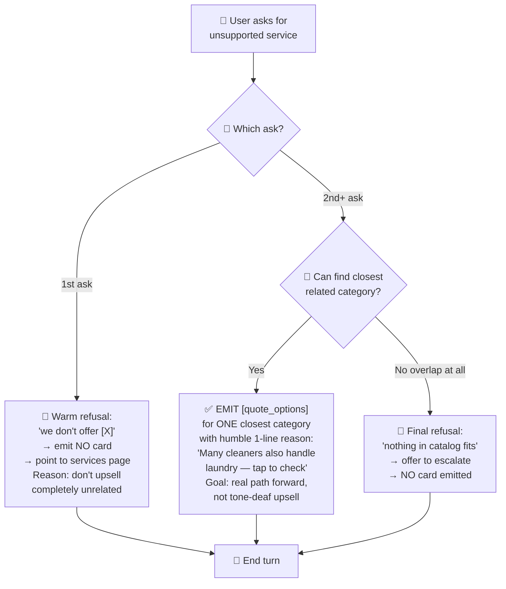
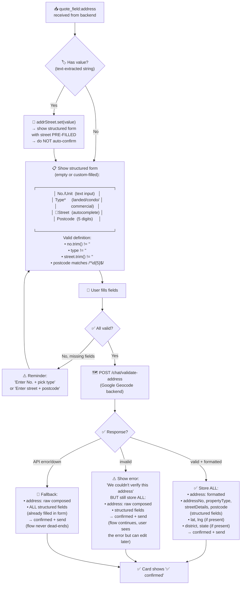
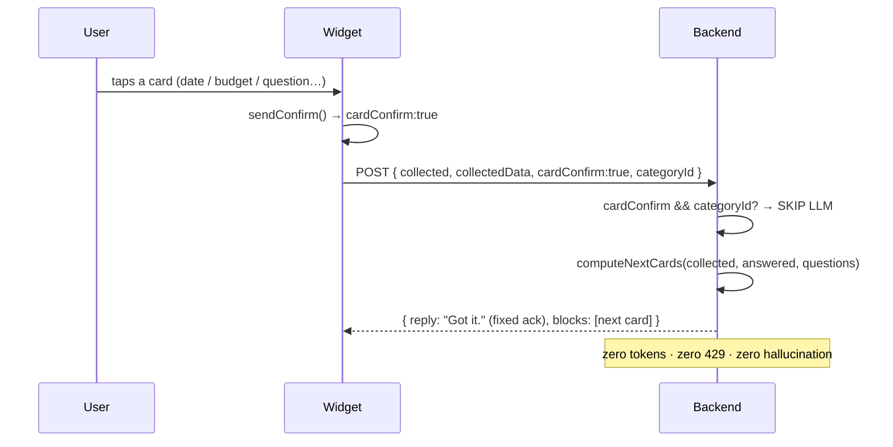
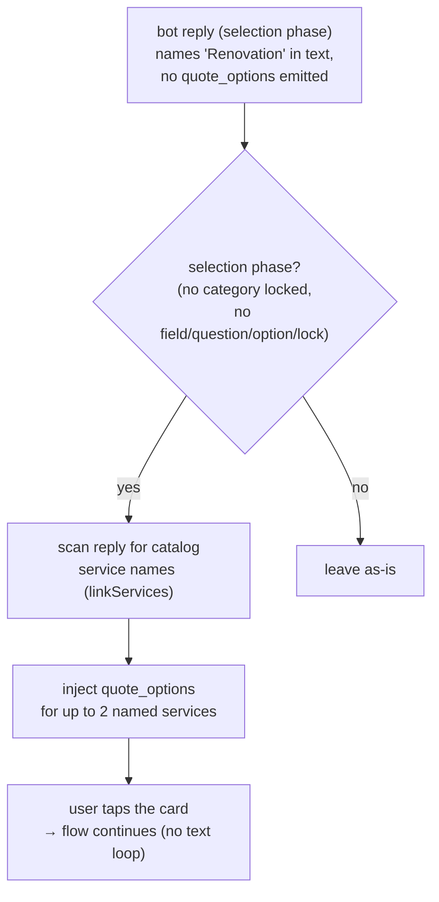

# Chat Bot + QA Harness Flow Diagrams

> **Legend**
> - **Block / Card / ActionBlock** = `[action:quote_options]...[/action]` — a structured UI component (date picker, address form, service picker) rendered in the chat bubble. Distinct from plain text.
> - **Text** = plain chat message with no action block — shows in bubble but no interactive card.
> - **State variables (per-turn)**:
>   - `selectedCategory` — user tapped or text-confirmed a service
>   - `lockedCategory` — `category_lock` emitted (silent, no card)
>   - `collectedFields` — fields with non-empty values in `prefillData()` (client sends via `collectedKeys()`)
>   - `missingFields` — derived from `nextStepBlocks`: what's still needed this turn
>   - `answeredQuestions` — service-question keys already answered (client sends via `answeredQuestions()`)
> - **Terminal outcomes**: PASS (review reached + all fields present + no qualityFail), FAIL (stalled/looping/language/unsupported/timeout/terminal)

---

## 1. Backend: sendToAi — main orchestration (chat.service.ts)

```mermaid
flowchart TD
    A["👤 User message + opts
    (collected, categoryId, answeredQ, lang)"] --> B["🧹 Sanitize history
    (drop 'Admin notice:' msgs)"]

    B --> C["📚 Load context:
    • categories (name+id)
    • categoryCatalog (full/compact)
    • questionSchema (if categoryId)
    • platformSettings (bannedWords, tone)
    • user account (name, bookings, quotes)
    • linkServices (for linkify)"] 

    C --> D{"🔗 Form-assist mode?
    (opts.formAssist)"}

    D -->|Yes| D1["📋 BUILD: form-assist prompt
    → Only emit [action:form_fill]
    FILTER: strip any quote_options/field/prefill
    (model ignoring form-assist mode)
    → Return"]
    D1 --> Z

    D -->|No| E["🧠 BUILD: system prompt
    = buildAssistantPrompt()
    + categoryCatalog
    + collectedData (exact values)
    + replyLanguage (LANG PIN)
    + strict-rules"]

    E --> F["🤖 CALL: LLM chain
    tryAiChain (60s budget)
    ┌─────────────────┐
    │ 1. DeepSeek     │ ← primary (fast, cheap)
    │ 2. Gemini ×4    │ ← backup (capacity)
    │ 3. OpenAI       │ ← last LLM resort
    │ 4. localFallback│ ← FAQ keyword match
    └─────────────────┘
    429 → 60s cooldown, skip to next
    Cold model → re-rotate after chain
    First-token timeout: 15s per LLM"]

    F --> G{"✅ Reply received?"}
    G -->|Yes| H["📝 Process reply
    → parseActionBlocks (regex)
    → stripActionBlocks
    → stripMarkdown
    → normalizeDashes
    → bannedWords replacer"]
    G -->|No (all failed)| G1["📋 Admin: LLM diagnostic
    (quota/auth/404 details)
    Guest/Cust: localFallback
    (FAQ keyword match)"]
    G1 --> Z

    H --> I["✅ Validate blocks
    • type in KNOWN_ACTION_TYPES?
    • quote_options: real UUID + category name?
    • form_fill: has field key?"]

    I --> J{"🔒 category_lock
    in model's reply?"}
    J -->|Yes, bogus UUID| J1["❌ DROP lock + drop
    all quote_question blocks
    that belong to wrong category"]
    J1 --> K
    J -->|Yes, valid UUID| J2["✅ Keep lock → category settled"]
    J2 --> K
    J -->|No| K

    K{"🛒 Still choosing category?
    (= quote_options blocks visible,
    OR no category context)"}

    K -->|Yes| K1["🚫 GUARD: strip premature blocks
    • quote_field (collecting before service)
    • quote_prefill (review before service)
    • quote_question (no category yet)"]
    K1 --> Z

    K -->|No → field collection phase| L["🔍 Extract & pre-fill
    from USER words only
    ┌──────────────────────────┐
    │ hasDateIntent →          │
    │   parseDateTimeFromText  │
    │   → preferredDate,slot   │
    │ extractBudget → budgetMax│
    │ extractPhone → contactNr │
    │ 🚫 NO address extraction │
    │ (needs structured form)  │
    └──────────────────────────┘"]

    L --> M["❓ Service questions
    • mark answeredQ (client + model)
    • matchQuestionAnswer (number/radio/checkbox→array)
    • inject next unanswered question
    (one at a time, with translated labels)"]

    M --> N["📊 nextStepBlocks(done)
    → what's still missing?
    missing date → emit preferredDate+timeSlot
    missing address → emit address
    missing budget → emit budgetMax
    missing contact → emit contactName+contactNumber
    all base done → inject question
    all questions done → emit quote_prefill"]

    N --> O["🧹 Deduplicate
    • strip already-collected fields
    • strip already-answered questions
    • (skip if user wants to EDIT:
      'change/edit/wrong/not right')"]

    O --> P["🧹 Sanitize output
    • max 3 distinct quote_options
    • drop parent categories if child present"]

    P --> Q{"✏️ User wants to edit
    a specific field?"}
    Q -->|Yes| Q1["📌 Re-open that field:
    strip questions + prefill,
    show ONLY that field card"]
    Q1 --> Z
    Q -->|No| Z

    Z["📤 Return:
    • answer (text, linkified)
    • actionBlocks (cards to show)
    • tokensUsed
    • decision log → console
      [chat] decision lang=ms cat=locked
      llm_emitted=[quote_field:preferredDate]
      sent=[quote_field:preferredDate, quote_field:timeSlot]
      collected=[preferredDate,timeSlot]
      reply='Got it, Sunday 14 June.'"]
```

---

## 2. Backend: step flow (card order, per prompt Steps 2→10)

```mermaid
flowchart LR
    S1["Step 1
    Understand need
    (text only)"]
    --> S2["Step 2
    Suggest category
    [quote_options]"]
    --> LOCK["🔒 category_lock
    (silent, hidden)"]
    --> S3["Step 3
    Date + Time
    [quote_field:preferredDate]
    [quote_field:timeSlot]"]
    --> S4["Step 4
    Address
    [quote_field:address]
    → structured form"]
    --> S5["Step 5
    Budget
    [quote_field:budgetMax]"]
    --> S6["Step 6
    Contact
    [quote_field:contactName]
    [quote_field:contactNumber]"]
    --> S7["Step 7
    Service questions
    [quote_question:*]
    (one at a time)"]
    --> S8["Step 8
    Notes
    [quote_field:notes]"]
    --> S9["Step 9–10
    Review + Submit
    [quote_prefill]
    All fields → quote form"]
```



---

## 3. Backend: refusal flow (service not in catalog)



---

## 4. Frontend: QA Harness — automated booking test (chat-qa-harness.ts)

```mermaid
flowchart TD
    START["🎲 makeScenario()
    → persona (typing/tone/behavior/sort/lang)
    → service (need + vague)
    → data (date, time, addr, budget, name, phone)
    → openingTurns (styled, 0-7 info pieces)
    → repeatsLeft (~30% chance)"]

    START --> CLEAR["🧹 host.clear() / host.refresh()
    • clear: wipe prefill + history + storage
    • refresh: reload from storage
      (test 'is this {name}?' restore flow)
    30% of guest runs (after first)"]

    CLEAR --> REFRESH{"🔄 Refresh mode?"}
    REFRESH -->|Yes, restored name == scn.name| ID["✅ confirmIdentity(true)
    → restore saved contact + continue"]
    REFRESH -->|Yes, restored name != scn.name| IDNO["🚫 confirmIdentity(false)
    → full resetQuoteFlowState, fresh start
    (assert prior category did NOT leak)"]
    REFRESH -->|Yes, but no confirm| ID_ERR["⚠️ issue:
    returning guest not asked identity"]
    REFRESH -->|No (clean start)| OPEN
    ID --> OPEN
    IDNO --> OPEN
    ID_ERR --> OPEN

    OPEN["💬 Send opening turns
    (styled: language + typing + tone)"]
    --> WAIT["⏳ waitIdle()
    • 1.8s grace for sending to rise
    • then up to 25s for reply
    • 250ms post-settle buffer"]

    WAIT --> FLUSH["📋 flush() — log new messages
    ┌────────────────────────────────┐
    │ Per-message: USER/BOT + txt   │
    │ + block tags                   │
    │ + strip [⚙] annotation ghosts │
    │                                │
    │ Batch: ⚠ NO CARD check        │
    │ If trailing assistant text     │
    │ mentions card/button words BUT │
    │ combined blocks have ZERO      │
    │ actionable types → warn once   │
    └────────────────────────────────┘"]

    FLUSH --> LOOP{"🔄 Loop
    step < MAX_STEPS (40)
    not cancelled"}

    LOOP --> BLOCKS["📦 latestBlocks()
    → aggregate blocks from ALL trailing
    assistant messages since last user turn
    → filter to ACTIONABLE types:
    quote_options, quote_field,
    quote_question, quote_prefill,
    identity_confirm"]

    BLOCKS --> CHECKS["🔍 Run per-card checks:
    ┌────────────────────────────────┐
    │ language: renderedLabel in     │
    │   conversation lang (zh/ta)?   │
    │ duplicate: same field/question │
    │   shown 2x in one reply?       │
    │   (quote_options include       │
    │    categoryId in signature)    │
    │ flow: field/question before    │
    │   ANY service was offered?     │
    └────────────────────────────────┘"]

    CHECKS --> EMPTY{"📭 No actionable
    blocks this turn?"}

    EMPTY -->|Yes| OOS{"🚫 Terminal?
    • out-of-service text
    • link fallback block?"}
    OOS -->|Yes| TERMINAL["❌ terminal=true
    → FAIL: 'assistant-error'"]
    OOS -->|No| NEED{"📤 needSent?"}
    NEED -->|No (0-info opening)| SEND_NEED["📨 Send needPhrase
    → continue loop"]
    NEED -->|Yes| EMPTY_T{"📊 emptyTurns >= 3?"}
    EMPTY_T -->|Yes| STALLED["❌ FAIL:
    'stalled' or 'unsupported'"]
    EMPTY_T -->|No| NUDGE["📨 Escalating nudge:
    [1] needPhrase
    [2] reworded question
    [3] 'I dont see a card,
         can you re-send?'
    → continue loop"]

    EMPTY -->|No| EMPTY_RESET["✅ emptyTurns = 0"]

    EMPTY_RESET --> REVIEW{"🏁 quote_prefill
    in blocks?"}
    REVIEW -->|Yes| SUCCESS["✅ success = true
    → break loop → checker"]

    REVIEW -->|No| REDUNDANT{"🔄 ALL cards
    satisfied by prefill?"}
    REDUNDANT -->|Yes| RENUDGE["📨 'all correct, continue'
    → redundantNudges++
    if >=2: stuck → FAIL"]
    REDUNDANT -->|No| FIRST["🎯 fresh[0]
    = first unsatisfied card"]

    FIRST --> LOOP_CHK{"🔁 Same card sig
    4+ consecutive turns?"}
    LOOP_CHK -->|Yes| LOOP_FAIL["❌ FAIL: 'looping'"]
    LOOP_CHK -->|No| FREETEXT{"🎲 35% chance
    + card is quote_field?"}

    FREETEXT -->|Yes, key has text answer| FT_SEND["📨 freeTextForField(key)
    → type answer as plain text
    → marks confirmedKeys
    → continue loop"]
    FREETEXT -->|No| ACT["🎬 actOnCard(b, scn)"]

    ACT --> ACT_TYPE{"🧩 Card type?"}
    ACT_TYPE -->|quote_options| OPTS["🔒 lockCategory
    or rejectCategory (reject_first behavior)"]
    ACT_TYPE -->|quote_field:preferredDate| CD["📅 confirmDate(scn.date)"]
    ACT_TYPE -->|quote_field:timeSlot| CT["🕐 confirmTime(scn.timeSlot)"]
    ACT_TYPE -->|quote_field:address| CA["📍 confirmAddress(scn.addr)
    → structured form fill"]
    ACT_TYPE -->|quote_field:budgetMax| CB["💰 confirmBudget(band)
    + wait for bracket load (≤3s)"]
    ACT_TYPE -->|quote_field:contactNumber| CP["📞 confirmPhone(digits)"]
    ACT_TYPE -->|quote_field:contactName| CN["👤 confirmTextField(name)"]
    ACT_TYPE -->|quote_field:notes| CNOTES["📝 confirmTextField(notes)"]
    ACT_TYPE -->|quote_question| AQ["❓ answerForQuestion(b)
    → non-rambler: first plausible
    → rambler: random plausible"]
    ACT_TYPE -->|identity_confirm| CID["🪪 confirmIdentity(true)"]
    ACT_TYPE -->|other| ERR["⚠️ catch → log error"]

    OPTS --> WAIT
    CD --> WAIT
    CT --> WAIT
    CA --> WAIT
    CB --> WAIT
    CP --> WAIT
    CN --> WAIT
    CNOTES --> WAIT
    AQ --> WAIT
    CID --> WAIT
    ERR --> WAIT

    WAIT --> REPEAT{"🔁 repeatsLeft > 0
    + 40% chance?"}
    REPEAT -->|Yes| REP_SEND["📨 repeatPhrase(scn)
    → test idempotency:
    does bot re-ask or dup?"]
    REPEAT -->|No| LOOP
    REP_SEND --> LOOP

    SUCCESS --> CHECKER["🔎 Final checker
    ┌──────────────────────────────────┐
    │ Terminal? → skip field check     │
    │                                  │
    │ Missing prefill fields?          │
    │ (categoryId, date, time, address,│
    │  budget, name, phone)            │
    │                                  │
    │ Unconfirmed? (in review but      │
    │   never via card → fabricated)   │
    │                                  │
    │ Quality fail? (language,         │
    │   redundant, duplicate,          │
    │   unconfirmed, refresh, flow,    │
    │   stuck, looping) → FAIL         │
    └──────────────────────────────────┘"]

    CHECKER --> FORM{"📋 submitAndVerifyForm
    available + review reached?"}
    FORM -->|Yes| WALK["🚶 Walk quote form pages
    → log per-page state
    → catch 'fill all required fields'
    → navigate back for next run"]
    FORM -->|No| RESULT
    WALK --> RESULT

    STALLED --> RESULT
    TERMINAL --> RESULT
    LOOP_FAIL --> RESULT

    RESULT["📊 QaRunResult
    ┌─────────────────────────┐
    │ ok: boolean             │
    │ label: scenario name    │
    │ steps: turns taken      │
    │ issues: string[]        │
    │ reachedReview: boolean  │
    └─────────────────────────┘
    → LLM judge reviews transcript
    → Summary: pass/fail counts,
      issue breakdown, conclusion"]
```

---

## 5. Frontend: Address card — client-side flow (chat-widget.component.ts)



---

## 6. Backend: collectingFields — deterministic extraction (sendToAi internals)

```mermaid
flowchart TD
    CF_PRE["🔑 Entry condition:
    hasCategoryContext = true
    AND no quote_options visible
    (= service is settled)"]
    --> CF_SCAN["📖 Scan ALL user messages
    (history + current turn)
    for date/time intent signals:
    • day/month/weekday names
    • today/tomorrow/weekend
    • morning/noon/evening/night"]

    CF_SCAN --> CF_PARSE["🕐 parseDateTimeFromText
    (assistant resolved text FIRST,
     then user raw text)
    → pick LAST fully-specified future date
    (avoids 'today' anchor trap)
    → preferredDate (YYYY-MM-DD)
    → timeSlot (morning|noon|...)"]

    CF_PARSE --> CF_DT["📅 fillField(preferredDate)
    fillField(timeSlot)"]

    CF_DT --> CF_BUDGET["💰 extractBudget(userConvo)
    from USER text only (not assistant)
    → budgetMax (integer RM)"]
    CF_BUDGET --> CF_BUDGET_FILL["📊 fillField(budgetMax)"]

    CF_BUDGET_FILL --> CF_PHONE["📞 extractPhone(userConvo)
    → +60XXXXXXXXX (E.164-ish)
    🚫 Strips date-like tokens first
    ('2026-06-19' → not a phone)"]
    CF_PHONE --> CF_PHONE_FILL["📞 fillField(contactNumber)"]

    CF_PHONE_FILL --> CF_DONE["📋 Build 'done' set:
    = opts.collected (client)
    + any field we just pre-filled
      with a value (this turn)"]

    CF_DONE --> CF_QUESTIONS["❓ Build 'answeredQ' set:
    = opts.answeredQuestions (client)
    + any quote_question with value
      emitted this turn (model)"]

    CF_QUESTIONS --> CF_MATCH["🔍 matchQuestionAnswer:
    if user msg is a bare number,
    matches a radio option label (→ value),
    or matches checkbox option label(s) (→ value array)
    → capture as answer
    → mark question answered"]

    CF_MATCH --> CF_NEXT["📊 nextStepBlocks(done):
    What's still missing?
    → inject missing cards"]

    CF_NEXT --> CF_DEDUPE["🧹 Deduplicate:
    • strip fields already in
      prefillData (collectedData)
    • strip answered questions
    • SKIP if user wants to EDIT
      (change/edit/wrong/...)"]

    CF_DEDUPE --> CF_LIMIT["🧹 Sanitize:
    • max 3 quote_options
    • drop parent categories
      if child present"]
```



---

## 7. LLM Chain: tryAiChain failover (chat.service.ts)

```mermaid
flowchart TD
    CHAIN_START["📨 Build chain:
    load LLM keys from DB
    (priority order, active only)
    fallback keys last"]
    --> CHAIN_LOOP{"⏱️ Budget remaining?
    (deadline = now + 60s)"}

    CHAIN_LOOP -->|No| CHAIN_FAIL["❌ Throw → localFallback
    or adminLlmDiagnostic"]

    CHAIN_LOOP -->|Yes| CHAIN_ITER["🔄 Iterate chain
    skip cooled-down keys (429, 60s)"]
    CHAIN_ITER --> CHAIN_TRY["▶️ Try LLM
    ┌─────────────────────────┐
    │ First-token timer: 15s  │
    │ → clears on reasoning   │
    │   OR content delta      │
    │ Overall timer: 60s      │
    │                         │
    │ Max tokens:             │
    │   DeepSeek: 4096        │
    │   Gemini: 1024          │
    │   OpenAI: 1024          │
    └─────────────────────────┘"]

    CHAIN_TRY --> CHAIN_OK{"✅ Answer?"}
    CHAIN_OK -->|Yes, complete| CHAIN_RET["📤 Return answer
    + tokensUsed
    + truncated flag"]

    CHAIN_OK -->|Yes, truncated + empty| CHAIN_OOS["🚫 Out-of-service
    → link + retry blocks"]

    CHAIN_OK -->|No (timeout/error)| CHAIN_NOTE["📝 noteKeyFailure:
    • 429 → 60s cooldown
    • other → log warn"]
    CHAIN_NOTE --> CHAIN_LOOP

    CHAIN_OK -->|No (cold model)| CHAIN_ROTATE["🔄 Re-rotate:
    all cold models retry
    (now warm after first attempt)"]
    CHAIN_ROTATE --> CHAIN_LOOP
```

---

## 8. End-to-end: one booking from open to review

```mermaid
sequenceDiagram
    participant U as 👤 User
    participant W as 🎨 Widget
    participant B as ⚙️ Backend
    participant L as 🤖 LLM

    U->>W: "my kitchen sink is leaking badly"
    W->>B: POST /chat/guest (msg, collected:[], lang:en)
    B->>L: buildPrompt + catalog + system
    L-->>B: "That sounds like a plumbing issue.
    [action:quote_options]\ncategory: Plumber\ncategoryId: 5080...[/action]"
    B->>B: validate blocks, decision log
    B-->>W: { text: "That sounds like...", blocks: [quote_options:Plumber] }
    W-->>U: "That sounds like a plumbing issue." + 🃏 Plumber card

    U->>W: Taps "Yes, that's it" on card
    W->>B: POST /chat/guest (msg, collected:[categoryId], categoryLocked:true, categoryId:5080...)
    B->>L: system + compact catalog + collected
    L-->>B: "[action:category_lock]categoryId:5080...[/action]
    [action:quote_field]key:preferredDate[/action]
    [action:quote_field]key:timeSlot[/action]"
    B->>B: validate lock UUID, inject nextStep
    B-->>W: { blocks: [preferredDate, timeSlot] }
    W-->>U: "When do you need it?" + 📅 Date + 🕐 Time

    U->>W: Picks 2026-06-19 + morning
    W->>B: POST (msg, collected:[...,preferredDate,timeSlot])
    B->>L: collected: date=2026-06-19, time=morning
    L-->>B: "[action:quote_field]key:address[/action]"
    B->>B: nextStepBlocks → address missing → emit
    B-->>W: { blocks: [address] }
    W-->>U: "Where should we go?" + 📍 Address form

    Note over W,U: Fills No/Type/Street/Postcode → Geocode → Confirm

    W->>B: POST (msg "Address: ...", collected:[...,address])
    B->>L: collected: address=...
    L-->>B: "[action:quote_field]key:budgetMax[/action]"
    B-->>W: { blocks: [budgetMax] }
    W-->>U: "What's your budget?" + 💰 Slider

    Note over W,U: Picks RM 300-600

    W->>B: POST (collected:[...,budgetMax])
    B->>L: collected: budgetMax=600
    L-->>B: "[action:quote_field]key:contactName[/action]
    [action:quote_field]key:contactNumber[/action]"
    B-->>W: { blocks: [contactName, contactNumber] }
    W-->>U: "Your name?" + 👤 "Phone?" + 📞

    Note over W,U: Types "Brian" and "0123456789"

    W->>B: POST (collected:[...,contactName,contactNumber])
    B->>L: collected: name=Brian, phone=+60123456789
    L-->>B: "[action:quote_question]key:whats_wrong\nlabel: What's the problem?[/action]"
    B->>B: inject unanswered question
    B-->>W: { blocks: [quote_question:whats_wrong] }
    W-->>U: "What's the problem?" + 🔘 Leaking / Clogged / ...

    Note over W,U: Answers all questions one by one

    W->>B: POST (answeredQuestions:[...])
    B->>B: all questions answered → nextStepBlocks → quote_prefill
    B-->>W: { blocks: [quote_prefill] }
    W-->>U: "Here's your summary!" + ✅ Review & submit
```

---

## Recent additions (2026-06-09)

### Deterministic card-confirm turn (LLM skipped)
A card tap sets `cardConfirm:true`; the backend returns the next card with no LLM call.



### Reject/stall recovery — named-service card inject
If a selection-phase reply names a catalog service but emits no card, the backend injects it.



### Catalog + personas
- **New services**: Painting (Home Improvement), Moving + Gardening (Home Maintenance) — own
  question schemas (non-essential questions skippable), budget ranges, card images. repaint→
  Painting, movers→Moving, lawn→Gardening map by name.
- **New QA personas**: `typing_shortcut` / `typing_adhd` — never tap a card, type every answer
  (shortcut SMS style / erratic kid input). See [chat-qa-harness.md](chat-qa-harness.md).
- **Failed-send retry**: one auto-retry after ~3.5 s before "Could not send message".
