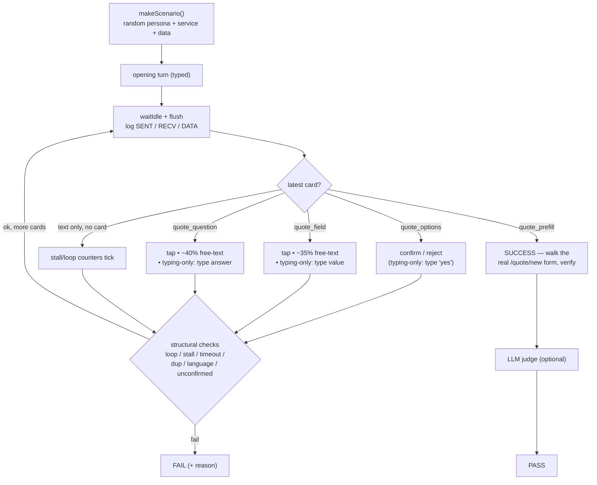

# Chat QA Harness — Complete Rules

Authoritative record of how the automated chat-QA harness works: what it simulates, the
full persona space, how it answers, every structural check, the log format, and how to run
it. Companion to [`ai-chat.md`](ai-chat.md) (the chatbot's own rules).

- Pure engine: [`frontend/src/app/shared/chat-qa-harness.ts`](../../frontend/src/app/shared/chat-qa-harness.ts)
- Runner / log writer: `chat-qa.service.ts`
- Host adapter (maps the engine onto the real widget): `buildQaHost()` in `chat-widget.component.ts`
- Logs: `logs/ChatQA_*.log`

---

## 1. What it does

Simulates real customers booking a quote **end to end against the live chatbot**, to catch
flow regressions (skipped service selection, jump-to-review, loops, stalls, hallucinated or
missing fields, broken question schema, wrong language). It drives the **real card handlers**
(it doesn't fake the UI), inspects whichever card the bot shows, and answers — until the
`quote_prefill` review card appears (success) or it stalls / loops / times out.

**Dev-only.** The QA button renders only in non-production builds; the log + judge routes
(`/chat/qa-log`, `/chat/qa-judge`) exist only when `NODE_ENV !== 'production'`.

**Requires LLM keys.** The harness drives the real bot, so the opening turn (understand the
need, suggest a service) calls the LLM. With no configured key every run dies at step 1 with
"out of service". `npm run db:reset` wipes admin-added keys (the seed seeds none) — re-add
them in Admin → API Keys before running.

---

### Drive loop (how one scenario runs)



## 2. Persona axes (the possibility space)

Each scenario picks one value per axis, at random (`makeScenario`):

| Axis | Count | Values |
|------|-------|--------|
| Typing | 7 | proper, lowercase, typos, abbrev, verbose, terse, slang |
| Tone | 6 | polite, blunt, impatient, friendly, anxious, chatty |
| Behavior | 8 | cooperative, reject_first, oversharer, self_correct, rambler, minimal, **typing_shortcut**, **typing_adhd** |
| Sorting | 6 | service_first, dump_all, address_first, budget_first, contact_first, vague_first |
| Language | 5 | en, ms, zh, ta, rojak |

### Possibility calculation

| Step | Factor | Running total |
|------|-------:|--------------:|
| Typing | 7 | 7 |
| × Tone | 6 | 42 |
| × Behavior | 8 | 336 |
| × Sorting | 6 | 2,016 |
| × Language | 5 | **10,080 persona combinations** |
| × Services | 16 | **161,280 scenario shapes** |
| × Budget tier | 3 | 483,840 |
| × `infoCount` (0–3) | 4 | 1,935,360 |
| × `repeats` (on/off) | 2 | **3,870,720** |

And that's **before** the continuous/random fields — future date, address pool, random
phone, name — which push the count far higher. So the practical space is **effectively
unbounded**; treat the headline as **10,080 persona combinations** and **≈161,000 distinct
scenario shapes**, with **millions** of unique full conversations once data is mixed in.

A run of N samples N at random (`makeScenario` picks every axis + datum independently); the
QA panel accepts up to 500. Even 500 runs covers <0.5% of the 161k shapes, but hits a broad
spread of behaviors/languages/services.

### Behavior meanings
- **cooperative** — follows prompts, picks first option (baseline).
- **reject_first** — rejects the first service suggestion (tests recovery).
- **oversharer** — adds extra/irrelevant info (tests filtering).
- **self_correct** — states then corrects (tests the edit path).
- **rambler** — drifts, picks random options (tests contradiction handling).
- **minimal** — terse answers (tests prompting).
- **typing_shortcut** — NEVER taps a card; types every answer in terse SMS shortcuts (tests pure free-text extraction).
- **typing_adhd** — NEVER taps a card; erratic kid/ADHD input: one off-topic non-answer per card before the real value (tests recovery from chaotic input).

---

## 3. How it answers a card

For each card the bot shows, the engine acts by type:

| Card | Default action | Free-text variation |
|------|----------------|---------------------|
| `quote_options` | tap confirm (or reject for reject_first) | typing-only personas type "yes"/the need |
| `quote_field` | tap the field control with the scenario value | ~35% of the time types it instead (date/time/budget/phone via `freeTextForField`) |
| `quote_question` | tap the option | ~40% of the time types a natural sentence (`naturalQuestionReply`) — ramblers excluded |
| `quote_prefill` | reaching it = success (form-check then walks the real /quote/new form) | — |
| `identity_confirm` | tap yes | always tapped (it's a gate, not data) |

**Typing-only personas** (`typing_shortcut`, `typing_adhd`): bypass all card taps and type
every answer (`typingFieldText` covers address/name/property-type that `freeTextForField`
skips). They will surface the structured-address gap (a typed address leaves No/Postcode/Type
empty) — that is a real, worth-surfacing finding, not a harness bug.

**Pacing:** ≥6 s between sends (`MIN_GAP`) to stay under the guest rate limit (10/min prod,
100/min dev). `waitIdle` then waits for the in-flight reply (up to 25 s).

---

## 4. Structural checks (deterministic — these decide pass/fail)

Run in `driveScenario`; any one flips the run to FAIL:

| Check | Fires when |
|-------|-----------|
| `looping` | the same card appears 4× — flow not advancing |
| `stalled` | the bot stays on text for N turns without advancing |
| `timeout` | review card not reached in 40 steps |
| `duplicate` | the same field/question card shown twice in one reply |
| `language` | a card's rendered label is not in the customer's language |
| `redundant` | the bot re-asks a field already given |
| `unconfirmed` | a field is in the review but was never collected on a card (suspected fabrication) — note: can false-positive when a value was given by free text |
| `incomplete prefill` | a required base field is missing at the end |
| `flow` | a detail collected before a service is established (out of order) |
| `⚠ NO CARD` | the reply text says "tap the card" but no actionable card was emitted |
| `refresh` | a returning guest isn't offered the "is this {name}?" restore after reload |
| `assistant-error` | the bot dropped to the out-of-service / link fallback (LLM chain exhausted) |
| `no-transcript` | the conversation produced no messages |

Required base fields: `categoryId, preferredDate, timeSlot, address, budgetMax, contactName, contactNumber`.

### LLM judge (optional)
After the structural pass, `judgeConversation` (DeepSeek) reviews the transcript for
logical/prose problems a structural checker can't see: wrong language, invented data,
contradictions, wrong service, out-of-order flow. Logs "judge unavailable" if no LLM key.

---

## 5. Log format (per turn)

```
[HH:MM:SS] USER: <content> [cards]
[HH:MM:SS] BOT : <content> [cards]
  > SENT collected=[...] data={...} cardConfirm=… cat=… lang=…   ← request body the FRONTEND sent
  < RECV reply="…" cards=[…]                                       ← BACKEND response
  = DATA cat= date= time= addr= no= postcode= type= budgetMax= budgetIndex= name= phone=  ← actual prefill
```

The widget records each `/chat` request body + response into `qaRestLog` (QA-runs only,
capped, cleared per scenario); `QaHost.restLog()` exposes it; `flush()` emits the trace when
there's new activity. The `DATA` line is the data the quote form will receive — it makes
data-divergence bugs (budget amount vs index, a dropped field, a wrong language) visible
without guessing.

---

## 6. How to run

1. Ensure LLM keys exist (Admin → API Keys).
2. Open the chat widget (dev build) → QA button → enter the QA PIN → set run count (1–500).
3. Logs write incrementally to `logs/ChatQA_<timestamp>.log` (survives a stop/crash).

---

## 7. Known limitations / open items (2026-06-09)

- **Seeded question labels aren't pre-translated** — `questionSchema` labels have no
  `labelI18n`; auto-translation only runs on admin save, so non-English chats show English
  card labels (flagged by the `language` check). Hits existing categories too.
- **Conversation language can stick** across scenarios (a zh run can bleed into the next
  EN run) — the conversation-language lock isn't reset between scenarios.
- ~~**reject→stall**~~ **FIXED (2026-06-09)** — a service-selection reply that names a catalog
  service but emits no card now gets that service's `quote_options` injected server-side; the
  stuck-watchdog also catches non-Latin question/colon endings.
- `unconfirmed` check over-flags values given by free text (credit a value that matches the
  scenario's intended data even if typed).
- New categories (painting/moving/gardening) have **no seeded servicers** yet.
